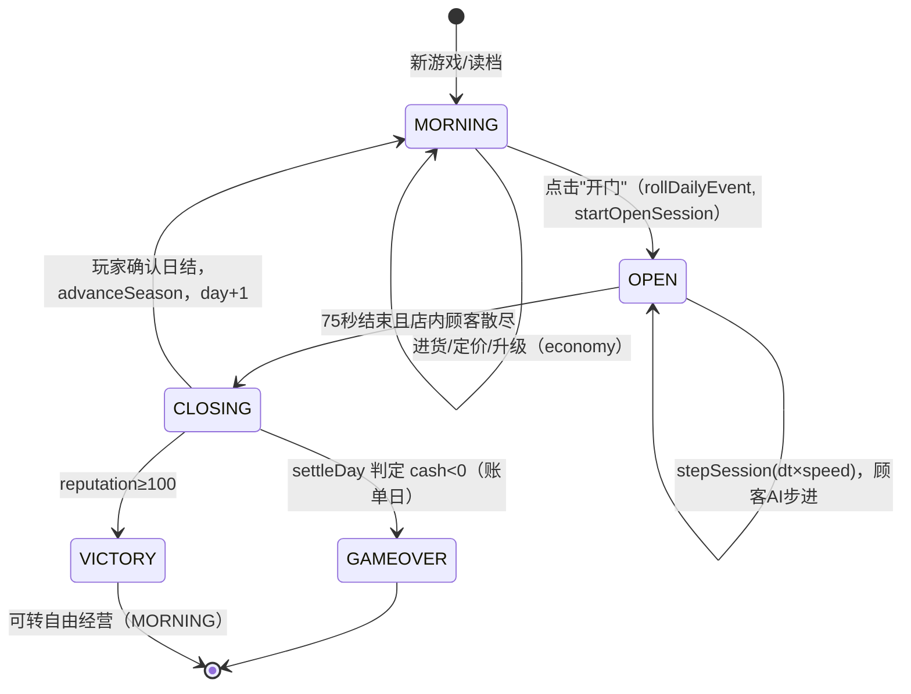
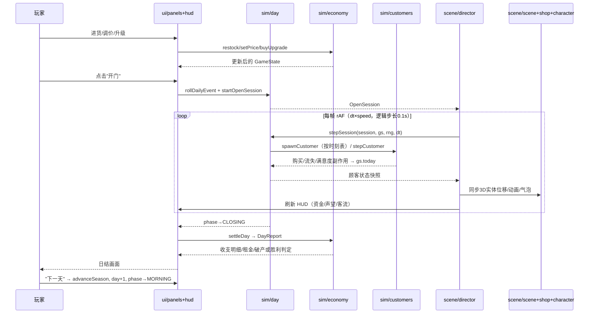
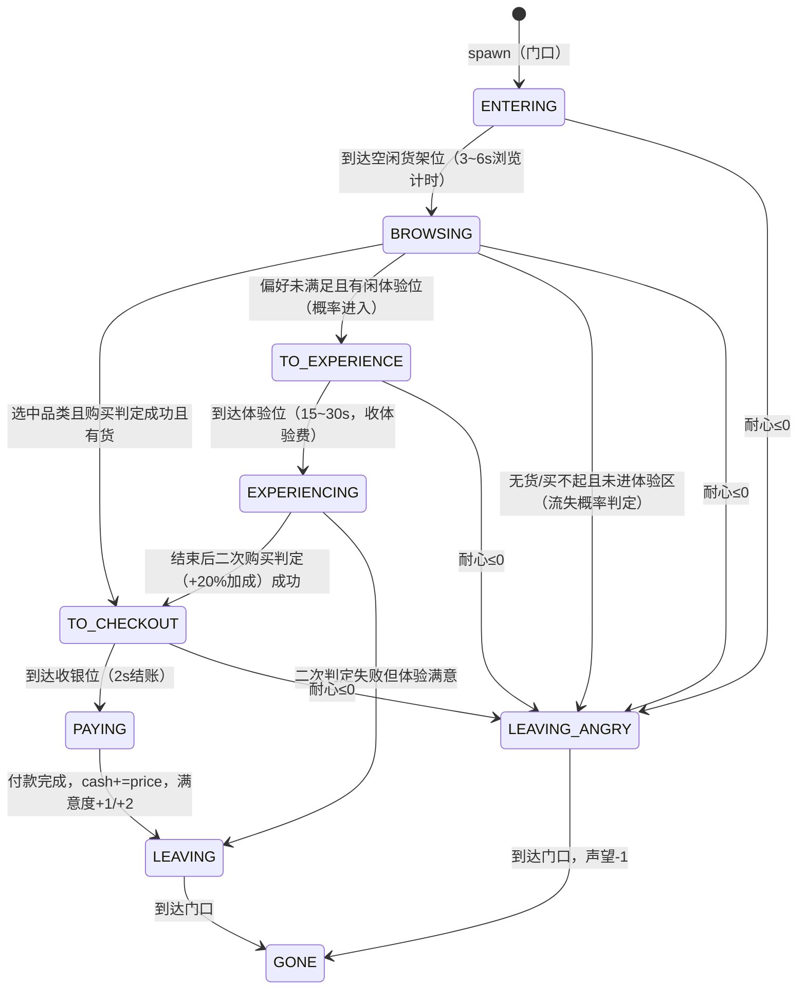

# ARCHITECTURE：3D 赛璐璐桌游店模拟经营游戏（Web 原型）

- **项目**: boardgame_shop_tycoon
- **依据**: docs/PRD.md + 主理人四项拍板决策（75 秒营业/轻干预、纯文本故事线、季节 P1 简化版、裁剪音效与贷款）
- **运行环境**: 现代浏览器（ES Module + import map），Windows 开发机，QA 用 Node 22 `node --test`

---

## 1. 实现方案与技术选型

### 1.1 核心技术挑战与对策

| 挑战 | 对策 |
|------|------|
| 零构建、浏览器直接可玩 | 原生 ES Module + import map 从 CDN 引入 Three.js；无 npm、无打包器，`index.html` 双击或任意静态服务器即可运行 |
| 逻辑可无头测试 | 游戏逻辑全部收敛在 `src/sim/` 纯 ES Module，**禁止 import DOM/Three**；所有随机性通过注入的 seeded RNG 产生，Node 22 `node --test` 直接跑 |
| 赛璐璐 3D 表现 | `MeshToonMaterial` + 3 阶 `gradientMap`（DataTexture 程序化生成）+ inverted hull 描边（背面外扩黑色壳，性能优于后处理 outline）；斜 45° 等距相机 |
| 顾客角色无外部模型 | 程序化低模 Q 版小人：Three 几何体拼装（胶囊身/球头/圆柱四肢），按顾客类型换配色与配饰 |
| 逻辑与渲染解耦 | `src/sim/` 以固定步长（0.1s 逻辑 tick）推进；`src/scene/director.js` 每帧读取 sim 状态插值渲染，2 倍速只是 tick 频率翻倍 |

### 1.2 技术选型定稿

| 项 | 选型 | 理由 |
|----|------|------|
| 3D 引擎 | **three@0.160.0**（import map 指向 unpkg/jsdelivr 的 `three/build/three.module.js`） | 唯一第三方依赖；0.160 稳定、MeshToonMaterial 成熟 |
| UI | 原生 DOM + CSS（无 React） | 面板/HUD 为表单与卡片，原生足够；省掉构建链 |
| 测试 | Node 内置 `node:test` + `node:assert` | 零依赖，符合约束 |
| 架构模式 | 分层：**sim（纯逻辑）→ scene（3D 呈现）/ ui（DOM 呈现）**，`main.js` 做薄编排 | sim 单测可独立验证经济平衡；呈现层只读状态+派发玩家意图 |

### 1.3 分层依赖规则（硬性）

```
ui/*  ─┐
       ├─→ sim/*  →  config.js, rng.js
scene/*┘
main.js 编排三者；sim/* 与 scene/*、ui/* 之间禁止互相 import；scene 与 ui 不互相 import。
```

---

## 2. 文件列表（共 20 个源文件，已达上限）

```
index.html                    # 入口页：import map（three CDN）、根节点、加载 main.js
styles/main.css               # 全部 UI 样式：HUD、面板、日结卡片、弹窗、气泡
src/main.js                   # 编排：初始化 sim/scene/ui，主循环 rAF，阶段切换
src/config.js                 # 唯一数值配置源（CONFIG 常量：商品/顾客/经济/季节/升级/事件）
src/rng.js                    # mulberry32 种子随机数工厂（可序列化状态）
src/sim/gameState.js          # GameState 创建、序列化/反序列化、初始库存与常客/图鉴初始化
src/sim/economy.js            # 经济公式：购买概率、客流、定价修正、季节热度、日结、租金、破产/胜利判定
src/sim/customers.js          # 顾客类型表消费、顾客生成器、AI 状态机步进 stepCustomer()
src/sim/day.js                # 日循环：晨间行动应用、营业会话（生成时刻表）、随机事件、季节轮换与活动周
src/sim/story.js              # 常客故事线推进 + 周边收藏掉落/效果
src/sim/save.js               # localStorage 存读档（P2，接口预留，成本低则实现）
src/scene/scene.js            # Three 渲染器/相机(等距45°)/光照(昼夜)/toon gradientMap/描边工具
src/scene/shop.js             # 店铺静态场景：地板、货架、体验桌(2-4)、收银台、装饰、门口
src/scene/character.js        # 程序化 Q 版小人构建 + 类型配色 + 心情气泡 emoji sprite
src/scene/director.js         # 桥接：把 OpenSession 中顾客 sim 状态映射为 3D 实体移动/动画/气泡
src/ui/hud.js                 # 顶部 HUD（日期/季节/资金/声望条/当日客流）+ 加速与打烊按钮
src/ui/panels.js              # 晨间决策面板（进货/定价滑杆/升级）+ 日结画面 + 破产/胜利画面
src/ui/codex.js               # 图鉴面板（常客故事/周边收藏 Tab）+ 顾客信息卡片 + 文本剧情弹窗
tests/economy.test.js         # 经济公式单测：购买概率边界、租金、破产/胜利、季节修正
tests/simulation.test.js      # 集成级单测：顾客状态机全路径、整日模拟冒烟、RNG 可复现性
```

---

## 3. 核心数据结构（TS 风格 interface，实现为纯 JS 对象）

```ts
// ---- 商品 ----
type CategoryId = 'boardgame_low' | 'boardgame_high' | 'snacks' | 'merch';
interface ProductDef {          // 静态定义，放 config.js
  id: CategoryId; name: string;
  cost: number;                 // 进货价
  guidePrice: number;           // 指导价（cost×1.5~2.0）
  baseHeat: number;             // 基础热度 0~1（被偏好权重相乘）
}

// ---- 顾客 ----
type CustomerTypeId = 'student' | 'core' | 'collector' | 'casual';
interface CustomerTypeDef {     // 静态定义，放 config.js
  id: CustomerTypeId; name: string;
  pref: Record<CategoryId, number>;   // 品类偏好权重，Σ=1
  budget: [number, number];           // 消费力区间
  patience: [number, number];         // 耐心秒数区间
}
type CustState =
  | 'ENTERING' | 'BROWSING' | 'TO_EXPERIENCE' | 'EXPERIENCING'
  | 'TO_CHECKOUT' | 'PAYING' | 'LEAVING' | 'LEAVING_ANGRY' | 'GONE';
interface Customer {
  id: number; type: CustomerTypeId;
  budget: number;             // 生成时区间内抽取
  patience: number;           // 剩余耐心（秒）
  pref: Record<CategoryId, number>;
  state: CustState;
  target: CategoryId | null;  // 当前看中的品类
  slotId: number | null;      // 占用的货架/体验位/收银位编号
  timer: number;              // 当前状态剩余时长
  bought: { id: CategoryId; price: number }[];
  satisfaction: -1 | 0 | 1 | 2;
}

// ---- 升级 ----
type UpgradeLine = 'experience' | 'shelf' | 'decor';   // 各 1~3 级

// ---- 常客 / 收藏 ----
interface Regular { id: string; name: string; type: CustomerTypeId;
  visits: number; storyStage: 0|1|2|3; completed: boolean; }
interface Collectible { id: string; name: string; rarity: 'normal'|'rare'|'legendary';
  owned: boolean; }

// ---- 季节 ----
type SeasonId = 'spring' | 'summer' | 'autumn' | 'winter';  // 每 10 游戏日轮换

// ---- 全局状态（唯一可变状态树，可 JSON 序列化）----
interface GameState {
  day: number;                                   // 从 1 开始
  phase: 'MORNING' | 'OPEN' | 'CLOSING' | 'GAMEOVER' | 'VICTORY';
  cash: number;                                  // 整数金币
  reputation: number;                            // 0~100，≥100 通关
  inventory: Record<CategoryId, number>;
  prices: Record<CategoryId, number>;            // 允许 guidePrice ±50%
  upgrades: Record<UpgradeLine, 1|2|3>;
  regulars: Regular[];
  collectibles: Collectible[];
  season: SeasonId;
  eventToday: string | null;                     // 当日事件 id
  activityDaysLeft: number;                      // 活动周剩余加成天数
  today: DayStats;                               // 当日累计（收入/成本/客流/购买/流失/满意度）
  rngState: number;                              // mulberry32 状态，随档保存
}

// ---- 营业会话（不序列化，打烊即弃）----
interface OpenSession {
  clock: number;                // 0 ~ 75（营业秒数）
  speed: 1 | 2;
  spawnSchedule: number[];      // 本日各顾客的进店时刻（升序）
  customers: Customer[];        // 在场顾客
  nextCustomerId: number;
}
```

---

## 4. 模块接口与核心循环

### 4.1 关键函数签名

```
rng.js       createRng(seed) → { next():0~1, int(min,max), pick(arr), state }
gameState.js newGame(seed) → GameState； serialize(gs)/deserialize(json)
economy.js   purchaseProbability(customer, product, gs) → 0~1
             dailyFootfall(gs) → int
             restock(gs, orders: Record<CategoryId,number>) → 校验并扣现金/加库存(含稀有掉落交给 story)
             setPrice(gs, id, price) → clamp 到 ±50%
             buyUpgrade(gs, line) → boolean
             settleDay(gs) → DayReport（含租金/破产/胜利判定）
customers.js spawnCustomer(gs, rng, forcedType?) → Customer
             stepCustomer(c, session, gs, rng, dt) → 状态机推进，产生副作用记录到 gs.today
day.js       applyMorningActions(...)（内部调用 economy）
             rollDailyEvent(gs, rng) → 事件 id | null
             advanceSeason(gs) → 换季/活动周
             startOpenSession(gs, rng) → OpenSession
             stepSession(session, gs, rng, dt) → 推进时钟/生成/步进顾客；clock≥75 且顾客清空→'CLOSING'
story.js     onCustomerServed(gs, customer) → 触发常客进度/剧情事件队列
             rollCollectibleDrop(gs, rng, merchQty) → 进货附带稀有/传说掉落
save.js      saveGame(gs) / loadGame() → GameState | null  （key: 'bgs_save_v1'）
```

### 4.2 日循环状态机



### 4.3 典型一天的调用时序



---

## 5. 顾客 AI 行为状态机



**转移条件要点**（数值见 config.js）：
- 耐心从进店起倒计时，仅 `PAYING/LEAVING/GONE` 不再扣。
- 浏览选品：按 `pref[cat] × heat[cat] × (有货?1:0)` 加权随机；全店无其偏好货 → 直接走流失判定。
- 同屏上限 12 人；体验位/收银位不足时顾客在对应 `TO_*` 状态排队等待（耐心正常消耗）。
- 满意规则：购买且价格 ≤ 指导价×1.1 → +2；购买但偏贵 → +1；体验满意未购买 → 0；耐心耗尽/买不到 → -1。

---

## 6. 经济系统公式（可直接实现）

设 `r = price / guidePrice`（调价范围强制 clamp 到 `r ∈ [0.5, 1.5]`）。

1. **购买概率**
   `p = clamp(p0 × priceFactor × heatMult × decorMult, 0.02, 0.97)`
   - `p0`：品类基础购买倾向 = `0.55 + 0.35 × pref[cat]`（偏好越高越想买）
   - `priceFactor`：`r ≤ 1` 时 `1 + 0.4×(1-r)`；`r > 1` 时 `1 - 0.8×(r-1)`（即高于指导价每 10% → 概率 -8%，与 PRD 对齐）
   - `heatMult = 1 + seasonHeat[season][cat]`，季节修正 ∈ {+0.3, 0, -0.3}（config 表）
   - `decorMult = 1 + 0.05×(decorLevel-1)`；体验区二次判定额外 ×1.2
   - **预算硬约束**：`price > budget` 时 `p ×= 0.15`
2. **每日客流**
   `footfall = round((base(=10) + reputation/10) × eventMult × activityMult × legendMult)`
   - `eventMult`：事件表给（如网红探店 ×2，快递延迟 ×1 但减进货）
   - `activityMult = 1.25`（活动周有效时），`legendMult = 1.1`（持有任一传说周边）
   - 进店时刻：在 75 秒内按均匀分布 + 抖动生成 spawnSchedule
3. **体验区**：占用 15~30s，收体验费 `8 + 4×experienceLevel`；二次购买判定 ×1.2；体验位数量 = `1 + experienceLevel`（2~4 个）
4. **日结** `settleDay`：
   - `净利 = 销售收入 + 体验费 − 当日进货成本`
   - 账单日（`day % 7 === 0`）扣租金 `rent = 400/600/800`（按最高升级线等级 1/2/3）
   - `reputation = clamp(reputation + Σsatisfaction, 0, 100)`（满意+1/+2，流失-1）
   - 判定：账单日结算后 `cash < 0` → GAMEOVER；`reputation ≥ 100` → VICTORY
5. **进货**：`restock` 扣 `Σ cost×qty`；库存上限 = `10 + 5×(shelfLevel-1)`（按品类分别计）；merch 进货每单位独立 roll 稀有掉落（见 §共享约定）
6. **升级成本**：单线 1→2 级 1500，2→3 级 3500（config 表）

**平衡锚点**：初始资金 4000；预期 20~30 游戏日声望达 100；每天净利目标区间约 +50 ~ +400 随升级成长。

---

## 7. 任务列表（按依赖排序，供工程师批量实现）

| Task ID | 任务名 | 源文件 | 依赖 | 优先级 |
|---------|--------|--------|------|--------|
| **T01** | 项目基础设施：入口页/样式骨架/数值配置/随机数/编排骨架 | index.html, styles/main.css, src/config.js, src/rng.js, src/main.js(骨架) | — | P0 |
| **T02** | 模拟层-经济与日循环核心 | src/sim/gameState.js, src/sim/economy.js, src/sim/day.js, src/sim/save.js | T01 | P0 |
| **T03** | 模拟层-顾客AI/故事收藏 + 无头单测 | src/sim/customers.js, src/sim/story.js, tests/economy.test.js, tests/simulation.test.js | T02 | P0 |
| **T04** | 3D 场景层：赛璐璐渲染/店铺/程序化角色/导演桥接 | src/scene/scene.js, src/scene/shop.js, src/scene/character.js, src/scene/director.js | T01 | P0 |
| **T05** | UI 层 + 全链路集成联调 | src/ui/hud.js, src/ui/panels.js, src/ui/codex.js, src/main.js(完成) | T02, T03, T04 | P0 |

**说明**：T02 与 T04 在 T01 后可并行；T03 依赖 T02 的 GameState/经济接口；T05 最后集成并做数值手感微调。

---

## 8. 依赖清单

```
three@0.160.0        # 唯一第三方依赖；import map 指向 https://unpkg.com/three@0.160.0/build/three.module.js
                     # （备用 jsdelivr: https://cdn.jsdelivr.net/npm/three@0.160.0/build/three.module.js）
                     # 仅用 three 核心包，不用 addons/examples
node:test / node:assert   # Node 22 内置，无需安装
```

---

## 9. 共享约定（工程师必读）

1. **随机数**：一切随机必须来自 `createRng` 注入的 rng 实例，禁止 `Math.random()`；`rng.state` 存入 GameState 随档保存，保证可复现。种子默认 `Date.now()`，测试用固定种子。
2. **数值唯一来源**：所有可调数值（商品价格、概率系数、季节热度表、事件表、升级表、常客定义、收藏定义）集中在 `src/config.js` 的 `CONFIG` 常量；sim 代码内禁止裸数字。
3. **纯逻辑纪律**：`src/sim/**` 与 `src/config.js`、`src/rng.js` 不得 import DOM、window、three；函数优先纯函数，副作用集中写进 `gs.today` 与返回值。
4. **单位与类型**：金额为整数金币；时间为秒（number）；逻辑步长固定 `TICK = 0.1s`；角度/坐标仅 scene 层关心。
5. **命名**：camelCase；顾客/阶段状态用全大写字符串字面量（如 `'BROWSING'`、`'MORNING'`）；文件全小写。
6. **事件/剧情文案**：全部放 config.js 的字符串表（含 emoji），UI 只渲染。
7. **存档**：key `bgs_save_v1`，存 `serialize(gs)` 的 JSON；版本字段 `v:1` 以便日后迁移。
8. **3D 表现口径**：同屏顾客 ≤12；描边统一用 inverted hull（scale 1.04 黑色 BackSide 壳）；gradientMap 3 阶全局共享一份 DataTexture。

---

## 10. 待明确事项（已按假设落地，可在联调期修正）

1. **“活动周”时长**：主理人决策为"每季第 1 天触发活动周收益加成"。**假设**：季首日起连续 **3 天** `activityMult=1.25`（CONFIG 可调），事件弹窗通知。
2. **胜负后的自由经营**：VICTORY 后允许继续自由经营（沿用当前状态），仅弹一次结局横幅。
3. **轻干预交互**：营业阶段仅支持点击顾客弹信息卡（类型/偏好/心情 emoji），无任何引导操作；打烊按钮仅在无顾客在店时可用（或直接等时钟走完——**默认等时钟走完**，打烊按钮仅做 2 倍速切换）。
4. **常客出现机制**：**假设**常客按其类型混入每日客流，声望 ≥15/35/60 分别解锁 小满/老周/白梨 的首次到访；到访且满意则 storyStage+1。
5. **体验区排队**：体验位满时顾客在店中"站立等待"点排队，耐心照扣——简化实现，无专门排队动画。
