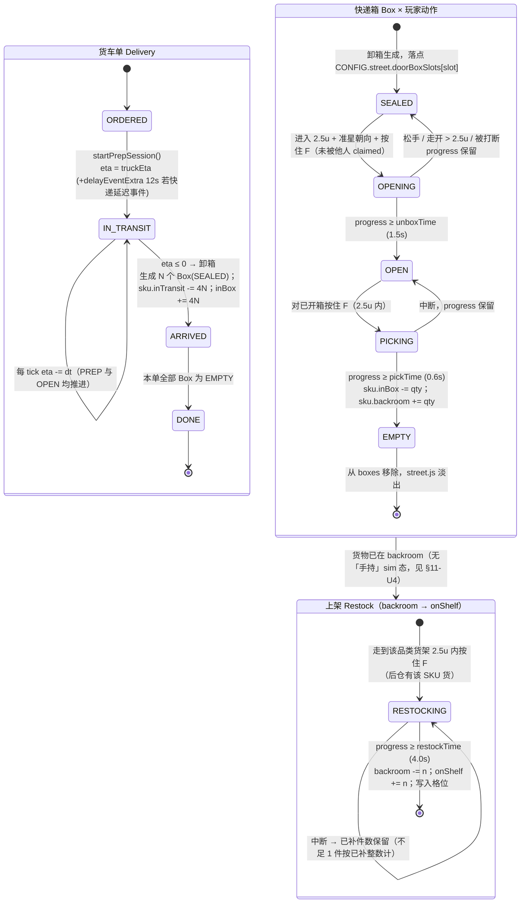
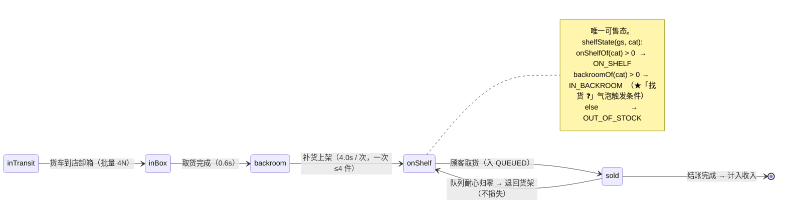
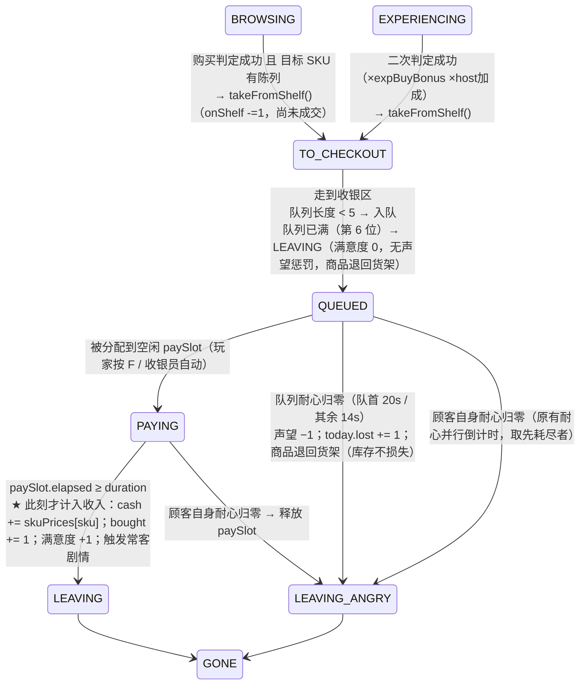
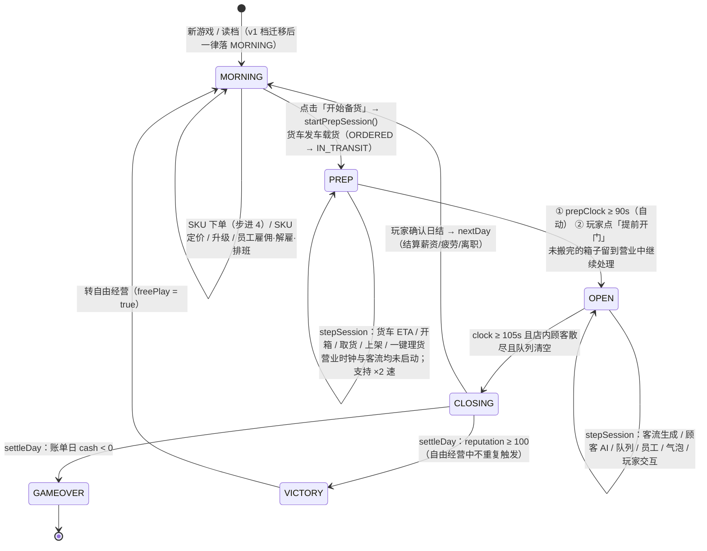
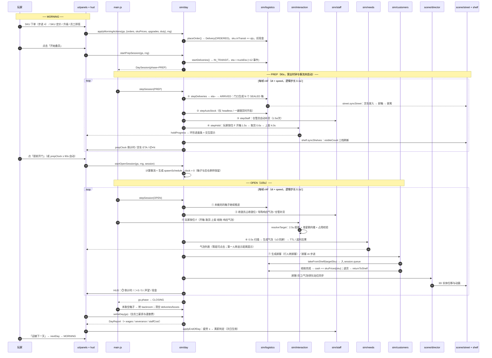
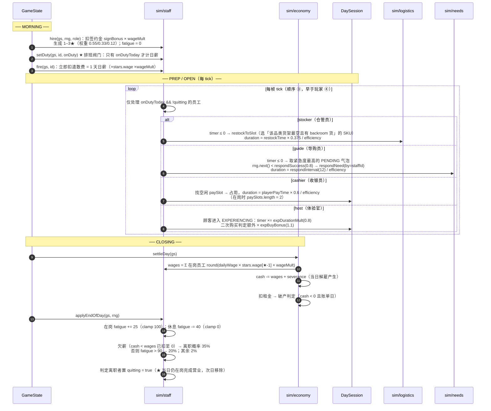
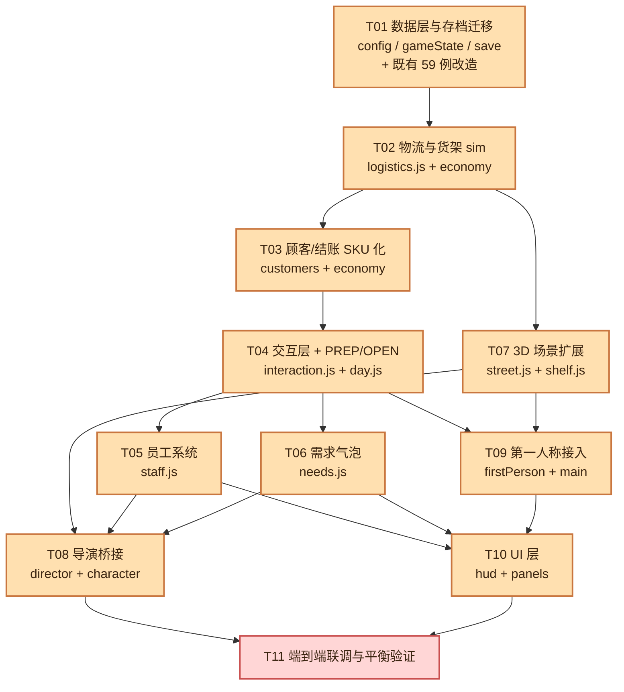

# 增量架构设计：场景 / 物流 / 结账 / 员工扩展（v2）

- **项目**：boardgame_shop_tycoon
- **基线**：`docs/ARCHITECTURE.md`（v1 架构）+ 已交付 v1 原型（19 个源文件 / 59 例 `node --test` 全绿 / 五种子 18–20 天通关 / 第一人称已交付）
- **需求基线**：`docs/PRD_INCREMENT.md` **v0.6.1**（58 条需求：P0 33 / P1 19 含待批 A33 / P2 6；Q1–Q14 全部拍完）
- **优先级口径**：`docs/PRD_INCREMENT.md §1 主理人裁决` 为硬约束；本文与 PRD 正文冲突时，以**主理人裁决 + 本文 §11 待明确事项的拍板**为准。
- **作者**：架构师 高见远
- **版本**：v1.1（对齐 PRD v0.6.1，新增 §12 对齐回执：A33 钩子 / A31 ×2 速 / B23 后仓门落点 / 街道坐标定稿）

> **阅读顺序**：§1（技术选型）→ §2（文件清单，硬性预算）→ §3（数据结构，实现真值）→ §4（状态机）→ §5（调用流程）→ §6（员工）→ §7（存档迁移）→ §8（任务列表，工程师按此开工）→ §9（测试策略）→ §10（共享约定）→ §11（待明确事项）→ **§12（PRD v0.6.1 对齐回执，开工前必读）**。

---

## 1. 增量实现方案与技术选型确认

### 1.1 技术选型：全部沿用 v1，**零新增依赖**

| 项 | 结论 | 说明 |
|----|------|------|
| 3D 引擎 | **three@0.160.0**（`index.html` import map → CDN，unpkg 主 / jsdelivr 备） | **不变**。本增量只新增程序化几何体（街道、门头、货车、快递箱、货架商品实例、员工小人），全部可用 three 核心包表达，**不引入 addons / examples** |
| 构建链 | **无**（原生 ES Module，双击 index.html 或任意静态服务器可跑） | **不变** |
| UI | 原生 DOM + CSS | **不变** |
| 测试 | Node 22 内置 `node:test` + `node:assert` | **不变** |
| 随机源 | `src/rng.js` mulberry32 + 注入式 rng | **不变**；新增模块一律走注入 rng，**禁止 `Math.random()`** |
| 状态/渲染解耦 | sim（纯逻辑，0.1s 固定 tick）→ scene / ui（只读 + 派发意图） | **不变** |

**结论：本增量零新增依赖、零构建改动、零 CDN 改动。** `index.html` 判定为**不变**文件。

### 1.2 五个核心技术挑战与对策

| # | 挑战 | 对策 |
|---|------|------|
| **C1** | **重操作化后 headless 平衡验证失效** —— 货架初始为空（A11）+ 手动搬货，意味着"玩家 0 操作"时全店无货、顾客全流失，五种子通关天数基线（22–28 天）根本测不出来 | 在 `logistics.js` 内建 **`stepAutoStock`（虚拟搬运工）**，以 `unboxTime→pickTime→restockTime` 的**相同耗时**串行处理箱子，**默认对 UI 关闭、对 headless 测试开启**（`CONFIG.logistics.autoStockDefaultOn: false`）。它同时是 A32「一键理货」（efficiency 0.6）的实现基础。**这是本增量最大的架构风险，必须在 T02 完成、T11 验证** |
| **C2** | 库存从「品类整数」升级为「SKU × 四态 × 36 格位」，状态空间爆炸 | 拆成三层：① `skus[id].{inTransit,inBox,backroom,onShelf}` 为**真值**；② `shelfSlots[36]` 为**格位陈列**（`sku` 绑定 + `qty`）；③ `inventory[cat]` 为**派生聚合**（四态之和），保留 v1 语义以兼容既有经济模型与测试。三条不变式由测试守卫（见 §9.3） |
| **C3** | 玩家手动操作 / 员工自动作业 / 顾客 AI 三方并发，**重复结算与状态竞争** | 统一 **「占用标记 + 固定 tick 顺序」** 协议：所有可争夺对象带 `claimedBy`；`stepSession` 内 8 个子系统按固定顺序推进（§5.2）。玩家握有**单一交互槽** `session.interaction`，天然互斥 |
| **C4** | 场景向外扩展 **不能破坏已验证的室内碰撞盒与 BFS 连通性断言**（裁决 3 / 11） | **只向外、不动室内**：室内地板/墙/货架/体验桌/收银台/盆栽 AABB **一个字节都不改**；`firstPerson.bounds.maxZ` 4.55 → 8.0 只是**放宽上界**（单调放宽不产生新口袋）；B23 员工通道门降级为**视觉门 + 交互点，不开通行**（左墙 AABB 不动）。测试改双轨（§9.4） |
| **C5** | 源文件预算 ≤26，而新增 3 个系统 + 2 个场景模块 | 见 §2：最终 **25 个源文件**，含 6 个新增（比裁决 1 的 5 个多 1 个 `interaction.js`，论证见 §2.2），余额 **1 个** |

### 1.3 分层依赖规则（在 v1 基础上增补）

```
ui/*    ─┐
         ├─→ sim/*  →  config.js, rng.js
scene/*  ┘

sim 内部依赖方向（新增，禁止反向）：
  day.js ──→ interaction.js ──→ logistics.js
     │            │          ├─→ needs.js
     │            │          └─→ staff.js ──→ logistics.js
     ├────────────┴────────────→ customers.js（最小改动）
     └─────────────────────────→ economy.js ──→ story.js

硬性：
  · sim/** 与 config.js / rng.js 禁止 import DOM / window / three
  · sim/** 与 scene/**、ui/** 禁止互相 import；scene 与 ui 禁止互相 import
  · 新增的 4 个 sim 模块禁止 import customers.js（单向：customers ← 无）
    —— 顾客 AI 需要读货架状态时，通过 logistics.js 的导出函数（shelfState / onShelfOf）
```

---

## 2. 完整文件清单（25 个源文件，预算 26，余额 1）

### 2.1 清单总表

| # | 文件 | 状态 | 职责（一句话） | 主要增量内容 |
|---|------|------|---------------|-------------|
| 1 | `index.html` | **不变** | 入口页：import map（three CDN）、四个根节点、加载 main.js | — |
| 2 | `styles/main.css` | 修改 | 全部 UI 样式 | 新增：环形进度条、交互提示条、队列牌、需求气泡列表、SKU 下单/定价表、员工卡片、后仓面板、距离提示 |
| 3 | `src/config.js` | 修改（大） | 唯一数值配置源 | 新增 `skus`(13) / `categoryDefaultSku` / `logistics` / `shelf` / `checkout` / `time` / `employees` / `needs` / `street` / `interaction` 段；`version:2`；`saveKey:'bgs_save_v2'` + `legacySaveKey:'bgs_save_v1'`；`openDuration:105`；`firstPerson.interactRange:2.5`（**唯一**） |
| 4 | `src/rng.js` | **不变** | mulberry32 种子随机工厂 | — |
| 5 | `src/main.js` | 修改 | 薄编排：初始化、主循环 rAF、阶段切换、输入派发 | PREP 阶段接入；F 键按住/松开 → `interaction.*`；Tab 后仓面板；Z 键相机预设；员工/气泡/队列的渲染编排 |
| 6 | `src/sim/gameState.js` | 修改 | GameState v2 创建、序列化/反序列化、**v1→v2 迁移** | 新增 `skus` / `skuPrices` / `shelfSlots` / `logistics` / `staff` 字段；`newDayStats` 增 `wages`/`severance`/`boxesOpened`；`migrateV1toV2()` |
| 7 | `src/sim/economy.js` | 修改 | 经济公式、进货下单、日结、破产/胜利判定 | `purchaseProbability` 支持 SKU def（含 `appeal` / 陈列不足惩罚）；`restock` 改为"下单→inTransit"（**保留签名与返回结构**）；新增 `setSkuPrice` / `inventoryCap` 语义不变；`settleDay` 增加员工薪资与遣散费 |
| 8 | `src/sim/customers.js` | 修改（**最小**） | 顾客生成 + AI 状态机 | `chooseTarget` 改用 `onShelf`；新增 `deriveTargetSku`（品类内价格最接近预算的在售 SKU）；新增 `QUEUED` 状态与队列耐心；购买改走「取货→入队→结账完成才入账」；怒走退货；**预留 A33 自助结账 3 行钩子（默认关闭）** |
| 9 | `src/sim/day.js` | 修改 | 日循环：PREP / OPEN 两阶段 tick 编排 | 新增 `startPrepSession` / `stepSession(PREP 分支)`；`startOpenSession(gs, rng, session=null)`；固定 8 步 tick 顺序；`delivery_delay` 事件改接 ETA+12s |
| 10 | `src/sim/story.js` | **不变** | 常客故事线 + 周边收藏掉落 | — |
| 11 | `src/sim/save.js` | 修改 | localStorage 存读档 | v2 key 写入；v1 key 兼容读取 + 一次迁移；`hasSave()` 双 key 探测；失败兜底 |
| 12 | **`src/sim/logistics.js`** | **新增** | 物流状态机 + 库存四态 + 货架格位 + `shelfState()` + `stepAutoStock` | 下单 / 发车 / 卸箱 / 开箱 / 取货 / 上架 / 退货 / 守恒同步 |
| 13 | **`src/sim/staff.js`** | **新增** | 员工：雇佣 / 解雇 / 排班 / 疲劳 / 离职 / 星级 / 四岗位自动作业 | `stepStaff` 在每 tick 内推进仓管补货、导购响应、收银员占收银位、体验官加成 |
| 14 | **`src/sim/needs.js`** | **新增** | 顾客需求气泡：扫描生成 / 优先级 / TTL / 冷却 / 响应结算 | 5 类气泡触发表；同屏上限 3；玩家 3s 全局冷却；顾客 6s 同类冷却；**第一人称 2.5 单位距离闸门（不可裁剪）** |
| 15 | **`src/sim/interaction.js`** | **新增**（论证见 §2.2） | 玩家交互：目标解算 + 按住 F 进度状态机 + 提交派发 | `resolveTarget` / `beginHold` / `stepHold` / `cancelHold`；统一 2.5 距离与朝向锥；中断保留 |
| 16 | `src/scene/scene.js` | 修改 | 渲染器 / 相机 / 光照 / toon / 描边工具 | 新增「店内 / 街道」双等距相机预设（Z 键切换，距离 ×1.35）；`makeToonMaterial` 增加"免描边"选项（行人与邻店省 draw call） |
| 17 | `src/scene/shop.js` | 修改 | 店铺静态场景 + 位置常量 | 货架商品小盒移交给 `shelf.js`（改为挂挂载点）；左墙新增**视觉员工通道门**（不开通行）；导出 `SHELF_X/SHELF_Z/EXP_SLOT_POS/CHECKOUT_POS` 常量不变 |
| 18 | `src/scene/character.js` | 修改 | 程序化 Q 版小人 + 气泡 sprite | `LOOKS` 新增 `staff`（工牌 / 围裙配色）；`buildCharacter(kind)` 支持 `'staff'`；气泡支持"需求气泡"样式（带 SKU emoji + 名称 + 售价） |
| 19 | `src/scene/director.js` | 修改 | sim → 3D 桥接（顾客 / 员工 / 气泡 / 队列） | 顾客 `QUEUED` 排队站位；需求气泡 sprite；**员工实体复用 Q 版小人**并缓动到任务目标点；行人→顾客衔接；同屏 ≤24 |
| 20 | `src/scene/firstPerson.js` | 修改 | 第一人称控制 + 纯函数碰撞 | `bounds.maxZ` 4.55 → 8.0；新增 `doorSlowFactor()`（门口箱子超限时 ×0.7）；新增 `distance2D()` / `withinRange()` / `aimScore()` 纯函数；**不新增任何障碍 AABB** |
| 21 | **`src/scene/street.js`** | **新增** | 街道外景 + 门头 + 行人 + 货车 + 快递箱视觉 | 人行道 / 马路 / 斑马线 / 路灯 / 行道树 / 长椅 / 邻店 ×3；店名招牌 / 橱窗 / 遮阳棚 / 营业灯牌；货车驶入驶离；快递箱三态（闭合 / 开盖 / 淡出） |
| 22 | **`src/scene/shelf.js`** | **新增** | 货架陈列：商品可见实例随陈列量变化 | `visibleCount(cat) = round(min(1, onShelf(cat)/displayCap) × slotsPerShelf)`；三档：`ON_SHELF` 1–9 实例 / `IN_BACKROOM` 空架 / `OUT_OF_STOCK` 空架 + 灰色缺货标签 |
| 23 | `src/ui/hud.js` | 修改 | 顶部 HUD + 营业中浮层 | PREP/OPEN 倒计时、货车 ETA、门口箱数 📦×N、**环形进度条**、交互提示、距离提示、队列牌 🧍×3/5、需求气泡列表（等距模式可点击） |
| 24 | `src/ui/panels.js` | 修改 | 晨间面板 / 日结 / 破产 / 胜利 / 标题 + **后仓面板 + 员工管理面板** | SKU 级下单（步进 4 = 一箱，受限 SKU 声望解锁）；SKU 级定价滑杆；员工雇佣/解雇/排班；后仓面板（Tab 或员工通道门打开）；日结新增薪资行 |
| 25 | `src/ui/codex.js` | **不变**（P2） | 图鉴面板 / 顾客信息卡 / 剧情弹窗 | A21「商品图鉴 Tab」为 P2，本轮不动 |

**统计**：新增 **6**（#12–15 四个 sim + #21–22 两个 scene）/ 修改 **15** / 不变 **4**（`index.html`、`rng.js`、`story.js`、`codex.js`）= **25 个源文件**（6 + 15 + 4 = 25 ≤ 26 ✓，余额 1）。

### 2.2 关于 `src/sim/interaction.js` 的论证（主理人要求先论证）

主理人裁决 1 只批了 5 个新文件，并要求论证「Part A 提的 `sim/interaction.js` 能否并入 `logistics.js`」。

**论证结论：不能并入，建议独立成文件。** 四条理由：

| # | 理由 | 说明 |
|---|------|------|
| R1 | **领域归属不符** | `interaction.js` 要覆盖 5 类交互：开箱 / 取货（`logistics`）、上架（`logistics`）、结账（`checkout` 属 `economy`+`staff`）、响应需求气泡（`needs`）。并入 `logistics.js` 会让 `logistics` 反向 import `needs` 与 `staff`，而 `staff` 又要 import `logistics`（仓管员补货）→ **形成循环依赖** |
| R2 | **它是「调度器」不是「领域逻辑」** | `interaction.js` 本身不含任何业务规则，只持有 `{kind, targetId, elapsed, duration, by}` 的进度状态与"完成后派发给谁"的分发表。独立后职责极清晰（预计 ~180 行），是典型的 **Mediator** |
| R3 | **可测性** | 「按住 F 中断保留」「2.5 距离闸门」「松手容忍」都是硬约束，必须在 Node 下无头测试。若塞进 `main.js`（DOM 层）则**完全不可测**；塞进 `day.js` 会让 `day.js` 从 201 行膨胀到 400+ 行，违反裁决「禁止把新逻辑堆进既有文件让它变胖」的**精神** |
| R4 | **依赖方向干净** | 独立后：`day.js → interaction.js → {logistics, needs, staff}`，与 `staff → logistics` 形成**单向 DAG**，无环 |

**代价核算**：25 个文件，仍在预算内，余额 1。**UI 层因此不加新文件**（把新增 UI 全部压进现有 `hud.js` / `panels.js`，二者当前仅 103 / 288 行，增长到 ~350 / ~600 行仍在可读区间；且 UI 在本项目无 DOM 测试，膨胀风险低于 sim 层不可测）。

**余额 1 个的使用规则（写给工程师）**：余额**冻结**，仅以下几种用途之一可申请解锁，且需架构师书面同意：① P2 的 `src/ui/codex.js` 因 A21 商品图鉴膨胀需拆出 `src/ui/codexSku.js`；② 出现不可预见的循环依赖需抽取中间模块。**不得**用于「把新逻辑塞回 `customers.js` / `day.js`」这类省文件方案。

---

## 3. 核心数据结构（GameState v2）

> 以下为 TS 风格 interface，实现为纯 JS 对象，整体可 JSON 序列化。

### 3.1 类型别名与枚举

```ts
type CategoryId = 'boardgame_low' | 'boardgame_high' | 'snacks' | 'merch';
type SkuId = 'cat_cafe' | 'undercover' | 'gem_trader' | 'civ_rise' | 'deep_space'
           | 'dragon_exp' | 'boba_tea' | 'hand_brew' | 'energy_bar'
           | 'dice_keychain' | 'sticker_pack' | 'metal_badge' | 'dice_tower';

type StockState  = 'inTransit' | 'inBox' | 'backroom' | 'onShelf';
type ShelfState  = 'ON_SHELF' | 'IN_BACKROOM' | 'OUT_OF_STOCK';
type DeliveryState = 'ORDERED' | 'IN_TRANSIT' | 'ARRIVED' | 'DONE';
type BoxState    = 'SEALED' | 'OPEN' | 'EMPTY';
type Phase       = 'MORNING' | 'PREP' | 'OPEN' | 'CLOSING' | 'GAMEOVER' | 'VICTORY';
type CustState   = 'ENTERING' | 'BROWSING' | 'TO_EXPERIENCE' | 'EXPERIENCING'
                 | 'TO_CHECKOUT' | 'QUEUED' | 'PAYING' | 'LEAVING' | 'LEAVING_ANGRY' | 'GONE';
type StaffRole   = 'cashier' | 'guide' | 'host' | 'stocker';
type NeedKind    = 'findItem' | 'complain' | 'checkout' | 'explain' | 'recommend';
type InteractKind = 'unbox' | 'pick' | 'restock' | 'pay' | 'respond';
```

### 3.2 商品：SKU 定义与库存四态

```ts
interface SkuDef {                 // 静态定义，CONFIG.skus（不序列化）
  id: SkuId; name: string; emoji: string;
  cat: CategoryId;                 // 所属品类（格位约束与偏好聚合用）
  cost: number;                    // 进货价（整数金币）
  guidePrice: number;              // 指导价
  rarity: 'common' | 'premium' | 'limited';
  unlockRep: number;               // 声望解锁门槛（0 / 30 / 55）
  appeal: Partial<Record<CustomerTypeId, number>>;  // 客群吸引力微调，缺省 1.0
}

interface SkuStock {               // ★ 库存真值（序列化）
  inTransit: number;               // 已下单、货车未到店（不可售）
  inBox: number;                   // 已卸箱、箱未开（不可售）
  backroom: number;                // 后仓（不可售，「找货 ❓」气泡弹药库）
  onShelf: number;                 // 货架陈列（唯一可售）
  soldTotal: number;               // 累计销量（P2 图鉴，先留字段）
}

// 派生（由 logistics.syncInventory 维护，其它模块只读）：
//   gs.inventory[cat] = Σ_{sku.cat === cat} (inTransit + inBox + backroom + onShelf)
//   可购买库存 onShelfOf(gs, cat) = Σ_{sku.cat === cat} sku.onShelf
//   后仓库存 backroomOf(gs, cat)  = Σ_{sku.cat === cat} sku.backroom
```

**四态守恒不变式（测试守卫，见 §9.3）**

```
∀cat: gs.inventory[cat] === Σ sku.(inTransit + inBox + backroom + onShelf)
∀cat: Σ slot.qty (该品类货架的 9 格) === Σ sku.onShelf
∀sku: slot.qty 之和（跨全部 36 格中 sku===该 sku 的格）=== skus[sku].onShelf
∀sku: 四态分量均为非负整数
```

### 3.3 货架格位

```ts
interface ShelfSlot {              // 36 个（4 品类 × 9 格），index = shelfIdx*9 + slotIdx
  cat: CategoryId;                 // 所属货架品类（由 index 推导，冗余存储便于序列化与校验）
  sku: SkuId | null;               // 格位绑定的 SKU（null = 空格）；售出到 qty=0 时**保留绑定**
  qty: number;                     // 0 .. stackCapByLevel[shelfLevel-1]
}
```

**关键设计**：`qty` 归零时**保留 `sku` 绑定**——格位代表玩家的「陈列决策」，卖空不会自动解绑，补货时优先回填，避免"卖一件就重排货架"的视觉抖动。

### 3.4 快递箱 Box 与 货车单 Delivery

```ts
interface Box {                    // 一箱 = 4 件同 SKU = 一次取货 = 补满一格
  id: number;
  deliveryId: number;
  sku: SkuId;
  qty: number;                     // = CONFIG.logistics.boxCapacity (4)
  state: BoxState;                 // SEALED → OPEN → EMPTY
  slot: number;                    // 门口落点序号（0..7），位置由 CONFIG.street.doorBoxSlots 决定
  progress: number;                // 当前交互累计秒（中断保留）
  claimedBy: 'player' | number | null;   // 'player' 或 staffId；非 null 表示被占用
  claimedKind: InteractKind | null;      // 'unbox' | 'pick'
}

interface Delivery {               // 一次下单 = 一辆货车
  id: number;
  state: DeliveryState;            // ORDERED → IN_TRANSIT → ARRIVED → DONE
  eta: number;                     // 剩余到店秒数（ORDERED/IN_TRANSIT 期间递减）
  boxes: number[];                 // Box id 列表
  orderedDay: number;
  delayed: boolean;                // 是否被「快递延迟」事件加成
}

interface LogisticsState {         // gs.logistics（序列化）
  deliveries: Delivery[];
  boxes: Box[];                    // 仅保留非空箱（EMPTY 立即移除）
  nextDeliveryId: number;
  nextBoxId: number;
}
```

> **箱子落点确定性**：`Box.slot` 按 `boxes.length % doorBoxSlots.length` 分配，**不用 rng**，保证 headless 可复现与 BFS 测试稳定。

### 3.5 员工 Staff

```ts
interface Staff {
  id: number;
  name: string;                    // 从 CONFIG.employees.namePool 取（P2 个性化）
  role: StaffRole;
  stars: 1 | 2 | 3;                // 效果 ×[1.0,1.25,1.5]，日薪 ×[1.0,1.4,1.9]
  fatigue: number;                 // 0..100 整数；上班 +25 / 休息 −40
  onDutyToday: boolean;            // ★「不上班不付薪」阀门
  hiredDay: number;
  wageMult: number;                // 候选人日薪浮动（P2，默认 1.0）
  quitting: boolean;               // 已判定离职，**次日生效**（当日仍在岗，避免中途消失）
  // —— 运行时（序列化，便于读档恢复 3D 位置）——
  pos: { x: number; z: number };
  task: StaffTask | null;
  timer: number;                   // 距下次自动动作的剩余秒
}

interface StaffTask {
  kind: 'restock' | 'checkout' | 'respond' | 'host';
  targetId: number | null;         // boxId / slotIndex / customerId / needId
  elapsed: number;
  duration: number;
}

interface StaffState {             // gs.staff（序列化）
  members: Staff[];
  candidates: Staff[];             // 候选人池（P2 每周刷新 3 人；P0 阶段为空 + 即时生成 1 名）
  nextId: number;
  autoRestockUsedToday: number;    // 仓管员当日自动补货次数（每日上限 autoRestockPerDay）
}
```

**效率换算（唯一公式，全模块共用）**

```ts
starMult(s)     = CONFIG.employees.stars.effect[s.stars - 1];        // 1.0 / 1.25 / 1.5
fatigueMult(s)  = s.fatigue <= 70 ? 1.0
                : s.fatigue <= 90 ? CONFIG.employees.fatigue.penaltyMult   // 0.7
                : CONFIG.employees.fatigue.severeMult;                     // 0.5
efficiency(s)   = starMult(s) * fatigueMult(s);                      // 分母
duration(s, base, roleMult = 1) = base * roleMult / efficiency(s);
```

举例：2★ 导购员疲劳 85 → `12 / (1.25 × 0.7) ≈ 13.7s`；仓管员补货 `4.0 × 0.375 / 1.0 = 1.5s` ✓（与 PRD §2.8 接口定稿一致）。

### 3.6 需求气泡 Need 与 结账队列

```ts
interface Need {
  id: number;
  customerId: number;
  kind: NeedKind;
  ttl: number;                     // 剩余存活秒
  priority: number;                // 紧急度：complain 5 > checkout 4 > findItem 3 > explain 2 > recommend 1
  state: 'PENDING' | 'CLAIMED' | 'RESOLVED' | 'EXPIRED';
  claimedBy: 'player' | number | null;
  // 展示派生（不序列化，由 UI 现算）：emoji / SKU 名 / 售价 / 顾客世界坐标
}

interface PaySlot {                // 并行收银位，session.paySlots
  customerId: number | null;
  elapsed: number;
  duration: number;                // 玩家 2.0s；收银员 2.0×0.6/efficiency
  by: 'player' | 'cashier' | null;
  staffId: number | null;
}
```

**队列**：`session.queue: number[]`（顾客 id，index 0 为队首），容量 `checkout.queueCapacity = 5`。
**顾客侧字段**：`c.queueWait`（已等待秒）、`c.queuePatience`（队首 20s / 其余 14s）、`c.needCooldown: Partial<Record<NeedKind, number>>`。

> **A33 自助结账（PRD v0.6.1 待批提案，已工程解耦）** —— 只占 3 个 config 字段 + `stepCheckout` 队首分支里的 3 行钩子，**不新增文件、不改数据结构、不改任务划分**。本设计按「关闭」落地：
>
> ```ts
> interface CheckoutConfig {
>   queueCapacity: 5;
>   headPatience: 20;                 // 队首
>   tailPatience: 14;                 // 其余
>   // ↓ A33 预留（默认关闭）
>   selfServiceAfter: 0;              // 0 = 关闭；>0 = 队首等待超过该秒数后自助结账（建议 14）
>   selfServiceTime: 5.0;             // 自助结账耗时
>   selfServiceSatisfaction: 0;       // 自助成交满意度（0 = 无加成也无惩罚），收入照常
> }
> ```
>
> 预留钩子（写在 `stepCheckout` 队首分支，`selfServiceAfter === 0` 时恒为 `false`，零行为差异）：
>
> ```js
> if (CONFIG.checkout.selfServiceAfter > 0 &&
>     head.queueWait >= CONFIG.checkout.selfServiceAfter) {
>   startSelfService(head);   // 5.0s；满意度 0；收入照常；不占 paySlot
> }
> ```
>
> **裁决后只改 `selfServiceAfter` 一个数字（0 → 14 或保持 0），零返工。** 详见 §12.1。

### 3.7 GameState v2（完整字段表）

| 字段 | 类型 | 状态 | 说明 |
|------|------|------|------|
| `v` | `2` | 新增 | 存档版本（serialize 写入） |
| `day` / `phase` / `cash` / `reputation` | 同 v1 | 保留 | `phase` 增加 `'PREP'` |
| `inventory` | `Record<CategoryId, number>` | **保留（改为派生）** | 四态之和；只在 `logistics` 内写入，其它模块只读 |
| `prices` | `Record<CategoryId, number>` | **保留** | 品类指导价，仅用于 v1 迁移与向后兼容；**玩法真值为 `skuPrices`** |
| **`skus`** | `Record<SkuId, SkuStock>` | 新增 | 库存四态真值 |
| **`skuPrices`** | `Record<SkuId, number>` | 新增 | SKU 级定价（±50% clamp 沿用） |
| **`shelfSlots`** | `ShelfSlot[36]` | 新增 | 货架格位陈列 |
| **`logistics`** | `LogisticsState` | 新增 | 货车单 + 快递箱 |
| **`staff`** | `StaffState` | 新增 | 员工与候选人 |
| `upgrades` / `regulars` / `collectibles` | 同 v1 | 保留 | — |
| `season` / `eventToday` / `activityDaysLeft` | 同 v1 | 保留 | — |
| `today` | `DayStats` | 扩展 | 新增 `wages` / `severance` / `boxesOpened` / `needsResolved` |
| `rngState` / `storyQueue` / `freePlay` | 同 v1 | 保留 | — |

### 3.8 DaySession（不序列化，替代原 OpenSession）

```ts
interface DaySession {
  phase: 'PREP' | 'OPEN';
  prepClock: number;               // PREP 已用秒（0 → 90）
  clock: number;                   // OPEN 已用秒（0 → 105）
  speed: 1 | 2;
  spawnSchedule: { t: number; regularId: string | null }[];  // PREP 期间为空
  customers: Customer[];
  nextCustomerId: number;
  expSlots: (number | null)[];

  queue: number[];                 // ★ 替代 v1 的 session.checkout（收银队列）
  paySlots: PaySlot[];             // ★ 并行收银位（长度 = 1 或 2）
  needs: Need[];                   // ★ 同屏 ≤3（PENDING+CLAIMED）
  needQueue: Need[];               // 超上限时按紧急度排队等待
  nextNeedId: number;
  needScanTimer: number;           // 0.5s 扫描节流
  playerNeedCooldown: number;      // 玩家全局 3s 冷却
  interaction: InteractionState | null;   // ★ 玩家单一交互槽

  pedestrians: Pedestrian[];       // 街道行人池（sim 持有，保证确定性）
  autoStock: boolean;              // ★ 虚拟搬运工开关（UI 默认 false / headless 测试 true）
  autoStockTimer: number;
  autoStockProgress: { boxId: number | null; kind: InteractKind; elapsed: number } | null;
  stockerTimer: number;            // 仓管员补货节流
  todayAutoRestockUsed: number;
}

interface InteractionState {       // session.interaction（玩家唯一槽位）
  kind: InteractKind;
  targetId: number;                // boxId / shelfIndex / paySlotIndex / customerId
  elapsed: number;
  duration: number;
  interrupted: boolean;            // 本 tick 是否因松手/走开而中断（供 HUD 提示）
}

interface Pedestrian {             // 视觉 + 客流来源
  id: number; x: number; z: number;
  dir: 1 | -1;                     // x 方向
  convertedTo: number | null;      // 被转成的顾客 id（非 null 时 street.js 不再渲染）
}
```

---

## 4. 状态机

> 独立 mermaid 文件：`docs/inc-logistics-state.mermaid`（物流 + 货架）、`docs/inc-customer-state.mermaid`（顾客 + 队列）、`docs/inc-day-phase.mermaid`（日循环）。

### 4.1 物流状态机（Delivery × Box × 库存四态）



**转移条件与耗时总表**

| 转移 | 触发条件 | 耗时 | 副作用 |
|------|---------|------|--------|
| `* → ORDERED` | `economy.restock(gs, orders, rng)`（MORNING） | — | 扣现金；`sku.inTransit += qty`；`inventory[cat] += qty`；`today.restockCost += spent`；merch roll 收藏掉落 |
| `ORDERED → IN_TRANSIT` | `day.startPrepSession()` | — | `eta = truckEta + (delayed ? 12 : 0)` |
| `IN_TRANSIT → ARRIVED` | `eta ≤ 0` | 8s（+12s 事件） | 生成 `ceil(qty/4)` 个 Box；`inTransit -= 4N`；`inBox += 4N` |
| `SEALED → OPEN` | 玩家/仓管**按住 F** | **1.5s** | `box.progress` 累加；中断保留 |
| `OPEN → EMPTY` | 玩家/仓管**按住 F** | **0.6s** | `inBox -= qty`；`backroom += qty` |
| `backroom → onShelf` | 玩家/仓管**按住 F** | **4.0s**（仓管 `×0.375 / eff` → 1.5s） | 逐件落格（§4.2）；`inventory` 不变（总量守恒） |
| `onShelf → (售出)` | 顾客购买判定成功 | — | `onShelf -= 1`；`inventory[cat] -= 1`；顾客入 `QUEUED` |
| `(怒走) → onShelf` | 队列耐心归零 | — | **退回货架**：`onShelf += 1`；`inventory[cat] += 1`（不损失） |
| `ARRIVED → DONE` | 全部 Box `EMPTY` | — | 货车驶离动画 |

**一箱 = 一取 = 补满一格**（裁决 8 / A07）：`boxCapacity(4) === restockPerAction(4) === stackCapByLevel[0](4)`。
**门口堆积惩罚（A06）**：`boxes.filter(state !== 'EMPTY').length > 8` 且玩家位于门口区域（`|x-5.8| < 1.6 && z > 4.0`）→ 移动速度 × `doorSlowMult(0.7)`。**软惩罚，不生成障碍 AABB**（保护 BFS 断言）。

### 4.2 货架格位与库存四态转移



**补货落格算法**（`logistics.restockToSlot`，确定性、可测）

```
n = min(restockPerAction(4), sku.backroom)
while n > 0:
  slot = 该品类 9 格中「sku === 目标 SKU 且 qty < stackCap」的第一个
       ?? 该品类 9 格中「sku === null」的第一个
  if slot == null: break            // 无空位，剩余留 backroom
  put = min(n, stackCap - slot.qty)
  slot.sku = 目标SKU; slot.qty += put
  sku.backroom -= put; sku.onShelf += put; n -= put
syncInventory(gs)
```

**售出扣格算法**（`logistics.takeFromShelf`）

```
从「sku === 目标 SKU 且 qty > 0」中取 qty 最大的一格（并列取 index 最小）
slot.qty -= 1；sku.onShelf -= 1；inventory[cat] -= 1
若 slot.qty === 0：保留 sku 绑定（陈列决策持久化）
```

### 4.3 顾客 AI 新增 `QUEUED` 与结账队列



**并行收银位分配规则**（`checkoutParallel(gs)`）

| 场景 | `paySlots.length` | 谁能占用 |
|------|------------------|---------|
| 无收银员在岗 | **1** | 玩家按 F 占用（一次一位，2.0s/位，与 v1 `payTime` 一致） |
| 收银员在岗 | **2** | 收银员自动占用空闲位（`2.0 × 0.6 / efficiency`）；玩家可占另一空闲位（**老板通道，与员工并行**） |
| 「结账 💳」气泡响应 | 占用任一空闲位 | 玩家亲自开临时收银，`duration = needs.types.checkout.playerPayTime (1.5s)`，期间不可做其他响应 |

### 4.4 日循环阶段机（新增 PREP）



**PREP 的软性设计**（裁决 5）：PREP 是**软资源**，随时可「提前开门」；未处理的箱子**留到 OPEN 继续处理**（`stepSession` 在 OPEN 阶段同样推进 `logistics` 与 `interaction`）。

**打烊时的箱子**：CLOSING 时未取空的箱子**直接转为 backroom**（不损失货），并清空 `logistics.deliveries/boxes`——避免"昨天的箱子今天还在门口"的状态泄漏。

---

## 5. 模块接口与调用流程

### 5.1 关键函数签名（增量部分）

```
// ---- config.js ----
CONFIG.firstPerson.interactRange = 2.5        // ★ 唯一真值；needs / logistics / checkout / interaction 全部读它
CONFIG.skus / CONFIG.categoryDefaultSku / CONFIG.skuOrder
CONFIG.logistics / CONFIG.shelf / CONFIG.checkout / CONFIG.time
CONFIG.employees / CONFIG.needs / CONFIG.street / CONFIG.interaction

// ---- sim/logistics.js（新） ----
placeOrder(gs, orders, rng)                   // 由 economy.restock 调用；生成 Delivery(ORDERED)
startDeliveries(gs, session, rng)             // PREP 开始：ORDERED → IN_TRANSIT，写 eta
stepDeliveries(gs, session, dt)               // eta 递减 → ARRIVED → 卸箱
unboxTick(gs, box, dt, by)                    // SEALED → OPENING → OPEN
pickTick(gs, box, dt, by)                     // OPEN → PICKING → EMPTY（inBox → backroom）
restockToSlot(gs, cat, sku, amount)           // backroom → onShelf（落格算法）
takeFromShelf(gs, sku)                        // 售出取货；返回 boolean
returnToShelf(gs, sku)                        // 怒走退货
onShelfOf(gs, cat) / backroomOf(gs, sku) / skuOnShelf(gs, sku)
shelfState(gs, cat)                           // → 'ON_SHELF' | 'IN_BACKROOM' | 'OUT_OF_STOCK'
displayedSkuCount(gs)                         // 全店有陈列的 SKU 数（陈列不足惩罚用）
syncInventory(gs)                             // 由四态重算 gs.inventory（守恒不变式维护点）
stepAutoStock(gs, session, dt)                // ★ 虚拟搬运工 / 一键理货（C1 的解）
autoStockBurst(gs, session)                   // A32：消耗 15s 一次性补货，效率 0.6
grantStock(gs, sku, state, qty)               // 测试专用：铺货（替代直接改 gs.inventory）
totalStock(gs) / stockInvariantOk(gs)         // 测试专用：守恒校验

// ---- sim/staff.js（新） ----
hire(gs, rng, role) / fire(gs, id) / setDuty(gs, id, onDuty)
stepStaff(gs, session, dt)                    // 仓管补货 / 导购响应 / 收银员占位 / 体验官加成
payrollFor(gs)                                // 当日薪资（仅 onDutyToday）
applyEndOfDay(gs, rng)                        // 疲劳 ±、离职判定（次日生效）
starMult(s) / fatigueMult(s) / efficiency(s) / durationFor(s, base, roleMult)
cashierOnDuty(gs) / guideOnDuty(gs) / hostOnDuty(gs) / stockerOnDuty(gs)
checkoutParallel(gs)                          // 1 或 2

// ---- sim/needs.js（新） ----
scanNeeds(gs, session, dt)                    // 0.5s 节流扫描 → 生成/TTL/清理
stepNeeds(gs, session, dt)
respondNeed(gs, session, needId, by, fp)      // by='player'|staffId；fp=是否第一人称（距离闸门）
canPlayerRespond(gs, session, needId, playerPos)  // 距离 2.5 + 全局 3s 冷却 + 同类 6s 冷却
needPriority(kind) / pickUrgent(session)

// ---- sim/interaction.js（新） ----
resolveTarget(gs, session, ctx)               // ctx = {x, z, yaw, viewMode, aimDir}
    // → {kind, targetId, label, distance, inRange} | null
beginHold(gs, session, kind, targetId)        // 校验占用 + 距离 + 冷却 → 占位
stepHold(gs, session, dt, holding)            // 进度累加 / 中断保留 / 完成派发
cancelHold(gs, session)                       // 松手 / 走开 / 阶段切换
holdProgress(session)                         // HUD 环形进度条数据源

// ---- sim/day.js（改） ----
startPrepSession(gs, rng)                     // → DaySession（phase PREP）
startOpenSession(gs, rng, session = null)     // ★ session 非 null 时复用（PREP→OPEN）；null 时新建（测试路径跳过 PREP）
stepSession(session, gs, rng, dt)             // 内部分派 PREP / OPEN；固定 8 步顺序
nextDay(gs, rng)                              // 增加员工疲劳/离职/薪资结算

// ---- sim/economy.js（改） ----
restock(gs, orders, rng)                      // 签名与返回不变；内部改为「下单 → inTransit」
setSkuPrice(gs, skuId, price)                 // SKU 级定价（±50% clamp）
purchaseProbability(customer, skuDef, gs, afterExperience)  // 兼容品类 def（cat 缺省取 id）
skuPriceOf(gs, skuId)                         // gs.skuPrices[skuId]
settleDay(gs)                                 // DayReport 增加 wages / severance / staffCost

// ---- sim/save.js（改） ----
loadGame()                                    // v2 → v1 兼容读取 + 一次迁移
migrateV1toV2(raw)                            // 见 §7

// ---- scene/street.js（新） ----
buildStreet(scene, gs)                        // → {group, positions:{truckStop, boxSlots[], sidewalkLane}, sync(), rebuild()}
syncStreet(streetCtx, gs, session, dt)        // 货车驶入驶离 / 快递箱三态 / 行人走动 / 装饰

// ---- scene/shelf.js（新） ----
buildShelves(scene, gs, shopCtx)              // → {group, sync()}
syncShelves(shelfCtx, gs)                     // visibleCount 三档呈现

// ---- scene/director.js（改） ----
sync(session, gs, dt, elapsed)                // 顾客 + 员工 + 气泡 + 排队站位
syncStaff(director, gs, session, dt, elapsed) // 员工实体（复用 character.js）
```

### 5.2 `stepSession` 固定 8 步执行顺序（**确定性与防重复结算的核心**）

```
stepSession(session, gs, rng, dt):
  if session.phase === 'PREP':
      session.prepClock += dt
      ① logistics.stepDeliveries(gs, session, dt)
      ② logistics.stepAutoStock(gs, session, dt)        // 虚拟搬运工 / 一键理货
      ③ staff.stepStaff(gs, session, dt)                // 仓管员在 PREP 即开始补货
      ④ interaction.stepHold(gs, session, dt, holding)  // 玩家进度
      ⑤ 若 prepClock ≥ prepDuration → startOpenSession(gs, rng, session)
      return

  // OPEN
  session.clock += dt
  ① logistics.stepDeliveries(gs, session, dt)       // 未搬完的箱子继续推进
  ② logistics.stepAutoStock(gs, session, dt)
  ③ staff.stepStaff(gs, session, dt)                // 员工先抢占用
  ④ interaction.stepHold(gs, session, dt, holding)  // 玩家后推进；被占则 begin 失败
  ⑤ checkout.stepPaySlots(gs, session, dt)          // 推进所有收银位（玩家位 + 员工位）
  ⑥ needs.stepNeeds(gs, session, dt)                // 扫描 / TTL / 冷却 / 超时后果
  ⑦ customers.stepAll(gs, session, rng, dt)         // 顾客 AI（含队列耐心、生成）
  ⑧ 阶段推进：clock ≥ openDuration 且 顾客清空 且 队列清空 → gs.phase = 'CLOSING'
```

**为什么这个顺序能防重复结算**

1. **员工（③）先于玩家（④）**：员工抢到 `claimedBy` 后，玩家 `beginHold` 立即失败并返回 `false`，HUD 提示「员工正在处理」。
2. **玩家只有一个槽位**：`session.interaction` 是单例，玩家不可能同时开箱与结账。
3. **结算只在占用者推进到期时执行一次**：`stepHold` / `stepPaySlots` / `staff.stepStaff` 到达 `duration` 后立刻清 `claimedBy` 并置终态（`RESOLVED` / `EMPTY` / `GONE`），后续 tick 不再命中。
4. **顾客 AI 最后（⑦）**：顾客只消费「已被别人改变的世界」，不会与员工/玩家争抢同一对象的同一 tick。

### 5.3 主时序图（PREP → OPEN 完整一天）

> 独立 mermaid 文件：`docs/inc-day-sequence.mermaid`



### 5.4 玩家交互如何进入纯 sim 层（**裁决 4 / 8 的落点**）

```
[DOM 事件] main.js
  keydown KeyF（held = true） / keyup KeyF（held = false）
  pointerlockchange / 每帧相机位姿 {x, z, yaw}
        │
        ▼  只传「意图 + 位姿」，不做任何业务判断
[sim] interaction.resolveTarget(gs, session, {x, z, yaw, viewMode})
        ├─ 候选集：boxes(SEALED/OPEN) / shelfSlots(4 个货架的交互点) / checkout 柜台 / queue 队首 / needs(PENDING)
        ├─ 过滤：distance2D(玩家, 目标) ≤ CONFIG.firstPerson.interactRange (2.5)
        │        ※ viewMode === 'iso'（等距俯瞰）时**不做距离过滤**（裁决 4）
        ├─ 过滤：第一人称下还需准星朝向锥（dot(aimDir, toTarget) ≥ CONFIG.interaction.aimConeCos）
        ├─ 过滤：目标未被 claimed / 顾客气泡还需玩家全局冷却结束
        └─ 排序：距离最近优先 → 返回 {kind, targetId, label, distance, inRange}
        │
        ▼
[sim] interaction.beginHold / stepHold / cancelHold
        └─ 完成后派发：logistics.unbox|pick|restock | checkout.pay | needs.respond
```

**距离口径一致性（裁决 8 的工程保证）**：`config.js` 中**只有 `CONFIG.firstPerson.interactRange = 2.5` 这一处 2.5 字面量**；`needs` / `logistics` / `checkout` / `interaction` 四个模块**一律读取该字段，禁止在各自 config 段里再写 range 字段**。QA 可用「在 config.js 全文检索 `2.5` 应只有 1 处命中」作为守卫。

### 5.5 sim → 3D 桥接扩展（director.js 如何消费新状态）

| 3D 实体 | 数据来源 | 归属文件 | 说明 |
|---------|---------|---------|------|
| 货架商品实例 | `logistics.onShelfOf(gs, cat)` + `shelfState` | **`shelf.js`** | `visibleCount = round(min(1, onShelf/displayCap) × slotsPerShelf)`；`ON_SHELF` 1–9 个 / `IN_BACKROOM` 空架 / `OUT_OF_STOCK` 空架 + 灰标签 |
| 门头 / 街道 / 邻店 / 路灯 / 长椅 | 静态（CONFIG.street） | **`street.js`** | 行人与邻店**不加描边**（省 draw call） |
| 街道行人 | `session.pedestrians[]` | **`street.js`** | `convertedTo !== null` 时不再渲染（已转顾客） |
| 货车 | `gs.logistics.deliveries[]`（`IN_TRANSIT` 驶入 / `ARRIVED` 驶离） | **`street.js`** | 停靠点 `street.truckStop = {x:8.5, z:7.2}`，与门口箱落点分离 |
| 快递箱 | `gs.logistics.boxes[]`（`SEALED` 闭合 + SKU 侧标 / `OPEN` 开盖 / `EMPTY` 淡出移除） | **`street.js`** | 落点 `street.doorBoxSlots[slot]` |
| 顾客（含排队） | `session.customers[]` | `director.js` | `QUEUED` → 沿收银台前排队站位 `shop.positions.queuePoint + i × 0.55`（−z 方向） |
| 顾客心情/需求气泡 | `c.state` + `session.needs[]` | `director.js` + `character.js` | 需求气泡显示「emoji + SKU 名 + 💰售价」，与心情气泡共用一个 sprite 槽位，**需求气泡优先** |
| **员工小人** | `gs.staff.members[]`（`onDutyToday` 且未离职） | `director.js` | **复用 `character.js` 的 `buildCharacter('staff')`**（裁决 10：不新建模）；按 `staff.task.kind` 取目标点缓动；围裙配色区分岗位 |
| 同屏预算 | 顾客 ≤12 + 行人 ≤8 + 员工 ≤4 = **≤24** | — | 目标 60 FPS @1080p |

---

## 6. 员工系统

### 6.1 生命周期与日结时序



### 6.2 与玩家操作的并存协议（**不冲突、不重复结算**）

| 机制 | 规则 |
|------|------|
| **单一玩家槽** | `session.interaction` 是单例——玩家物理上只有一双手，不可能同时开箱 + 结账 |
| **占用标记** | `box.claimedBy` / `paySlot.customerId` / `need.state + need.claimedBy`。**任何主体 begin 前必须校验并原子占位** |
| **固定顺序** | 员工（③）永远早于玩家（④）。员工抢到 → 玩家 `beginHold` 返回 `false`，HUD 提示「{员工名} 正在处理」，**不产生任何状态变化** |
| **玩家可被抢占吗** | **不能**。玩家一旦 `beginHold` 成功即占位到完成或主动中断；员工 tick 看到 `claimedBy === 'player'` 会跳过该对象。理由：玩家操作的响应性优先于 NPC 自动化 |
| **员工无玩家冷却** | 导购员**不受**玩家 3s 全局响应冷却限制（`needs.playerCooldown` 只对 `by === 'player'` 生效）；但**受**顾客同类 6s 冷却约束（避免刷满意度） |
| **并行收银** | 收银员占 `paySlots[i]`，玩家占另一个空闲 `paySlots[j]`，互不干扰；`stepPaySlots` 统一推进，完成即清位 |
| **体验官不抢位** | host 只修改时长与概率倍率，不占用任何对象 |

### 6.3 岗位效果汇总表（工程师实现清单）

| 岗位 | 效果 | 作用点 | 数值来源 |
|------|------|--------|---------|
| `cashier` 收银员 | 结账 `2.0s → 1.2s`；并行收银位 `1 → 2` | `session.paySlots` | `payTimeMult 0.6` / `parallelSlots 2` |
| `guide` 导购员 | 每 12s 自动响应 1 个气泡，成功率 80%，优先紧急度最高 | `needs.respondNeed(by=staffId)` | `respondInterval 12` / `respondSuccess 0.8` |
| `host` 体验官 | 体验时长 −20%；体验后二次购买判定额外 ×1.1 | `customers` 进入 EXPERIENCING / `decideAfterExperience` | `expDurationMult 0.8` / `expBuyBonus 1.1` |
| `stocker` 仓管员 | 上架 `4.0s → 1.5s`；每营业日自动补货 1 次（PREP 起即可工作） | `logistics.restockToSlot` | `restockTimeMult 0.375` / `autoRestockPerDay 1` |

**平衡意图（PRD §3.1.5，工程师不得擅自改动数值）**：员工不是赚钱工具，而是「用现金换声望 / 换容错」的杠杆。单人日薪 45–70，早期日均净利仅 +50~+150 → 雇人即显著吃紧。

---

## 7. 存档迁移方案 v1 → v2

### 7.1 字段映射表

| v1 字段 | v2 字段 | 迁移规则 |
|---------|---------|---------|
| `v: 1` | `v: 2` | 检测到 `v === 1` → 执行 `migrateV1toV2`，写回时 `v = 2` |
| `inventory[cat]` | `skus[categoryDefaultSku[cat]].onShelf` | **全额归入 `onShelf`**（裁决 9 / A-Q4：老档开门即满架，**不劣化**）。同时按 §4.2 落格算法填入该品类 9 格（每格 ≤ `stackCapByLevel[0] = 4`），超出部分**留在 `onShelf` 但不占格**（保守处理，避免溢出丢失） |
| `prices[cat]` | `skuPrices[sku]` | 等比缩放：`skuPrices[s] = clamp(round(prices[cat] × skus[s].guidePrice / products[cat].guidePrice), round(skus[s].guidePrice × 0.5), round(skus[s].guidePrice × 1.5))` |
| `prices[cat]` | `prices[cat]` | **原样保留**（兼容字段，迁移后不再作为玩法真值） |
| — | `shelfSlots[36]` | 由 `onShelf` 反推填充（见上行）；未分配到的格位 `{cat, sku: null, qty: 0}` |
| — | `skus[*].{inTransit, inBox, backroom}` | 全部 `0`（旧档无在途货） |
| — | `skus[*].soldTotal` | `0` |
| — | `logistics` | `{ deliveries: [], boxes: [], nextDeliveryId: 1, nextBoxId: 1 }` |
| — | `staff` | `{ members: [], candidates: [], nextId: 1, autoRestockUsedToday: 0 }` |
| — | `today.wages / severance / boxesOpened / needsResolved` | `0` |
| `phase` | `phase` | 若为 `'OPEN'` / `'PREP'` / `'CLOSING'` → **一律改为 `'MORNING'`**（会话对象不可序列化，重开当天）；`GAMEOVER` / `VICTORY` 保留 |
| `day / cash / reputation / upgrades / regulars / collectibles / season / eventToday / activityDaysLeft / rngState / storyQueue / freePlay` | 同名 | 原样透传 |

### 7.2 兼容读取流程

```
loadGame():
  1. json = store.getItem('bgs_save_v2')
     if json:  gs = deserialize(json)                    // v2 路径（deserialize 内仍做字段兜底）
  2. else:
     jsonV1 = store.getItem('bgs_save_v1')
     if !jsonV1: return null
     raw = JSON.parse(jsonV1)                            // 失败 → return null（不删 v1）
     gs = migrateV1toV2(raw)                             // 失败 → 见 §7.3
     store.setItem('bgs_save_v2', serialize(gs))         // 立即回写 v2（一次性迁移）
     // v1 key 保留不动（不删除），作为回滚保险
  3. return gs

hasSave():  v2 或 v1 任一存在即 true
clearSave(): 同时移除 v2 与 v1
```

### 7.3 失败兜底（**任何一步都不允许让旧档失效**）

| 失败点 | 兜底行为 |
|--------|---------|
| `JSON.parse` 抛错 | `return null`；**保留 v1 key 不动**，标题画面走「新开一家店」 |
| `migrateV1toV2` 中某个字段缺失/类型非法 | 用 `newGame(raw.rngState ?? 1)` 的默认值补齐该字段，其余字段照常迁移；**不整体拒绝** |
| `inventory[cat]` 为负 / NaN | 按 `0` 处理 |
| `prices[cat]` 缺失 | 用 `products[cat].guidePrice` |
| `upgrades` 缺项 | `{experience:1, shelf:1, decor:1}` 逐项兜底 |
| 迁移后 `stockInvariantOk(gs) === false` | 以 `skus` 为真值**重算** `inventory` 与 `shelfSlots`（`syncInventory` + 重铺格位），保证迁移产物一定自洽 |
| 写入 v2 失败（配额/隐私模式） | 静默失败；游戏继续用内存中的迁移结果，**不回滚** |
| 迁移整体抛异常 | `try/catch` → 返回「以 v1 的 `day/cash/reputation/rngState` 新建的 v2 档」，玩家损失进度但**能继续玩**（优于崩溃） |

> **测试要求**：`tests/migration.test.js` 必须覆盖「v1 档 → 迁移 → 库存/现金/声望守恒 → 可继续玩一整天 → 再存档读档一致」与「7 种损坏 v1 档的兜底」两组。

---

## 8. 任务列表（11 个任务，按依赖排序）

> **粒度原则**：每个任务对应一个可独立验收的功能切片，文件数 2–4 个，工程师可批量实现。
> **并行提示**：T05 与 T06 可并行；T07 与 T05/T06 可并行（scene 与 sim 无交叉 import）。

| Task ID | 任务名 | 涉及文件（增=新增 / 改=修改） | 依赖 | 优先级 | 验收点 |
|---------|--------|------------------------------|------|--------|--------|
| **T01** | **数据层与存档迁移**（含既有测试改造） | 改：`src/config.js`、`src/sim/gameState.js`、`src/sim/save.js`；改测试：`tests/economy.test.js`、`tests/simulation.test.js`、`tests/edge.test.js`；增测：`tests/migration.test.js` | — | P0 | ① 59 例既有测试「等价」全绿（改写清单见 §9.2）；② v1→v2 迁移 12 条映射全部有断言；③ 7 种损坏档兜底不抛异常；④ `CONFIG` 全文检索 `2.5` 仅 1 处命中；⑤ SKU 表 13 项、`categoryDefaultSku` 4 项齐全 |
| **T02** | **物流与货架 sim 层** | 增：`src/sim/logistics.js`；改：`src/sim/economy.js`（下单改 inTransit、SKU 聚合、陈列不足惩罚）、`src/sim/gameState.js`（新字段初始化）；增测：`tests/logistics.test.js` | T01 | P0 | ① 下单→在途→卸箱→开箱→取货→上架全链路；② 三条守恒不变式（§3.2）在任意操作序列后成立；③ 一箱 4 件 = 一取 = 补满一格；④ `shelfState()` 三态判定正确；⑤ 格位品类约束与堆叠上限；⑥ **`stepAutoStock` 可在 90s 内搬完 6 箱（24 件）** ← 验收 C1 |
| **T03** | **顾客 / 结账 SKU 化与队列** | 改：`src/sim/customers.js`（最小）、`src/sim/economy.js`（SKU 购买概率）；改测试：`tests/simulation.test.js`、`tests/edge.test.js` | T02 | P0 | ① 顾客只在 `onShelf > 0` 时购买；② `targetSku` = 品类中在售且价格最接近预算的 SKU；③ 队列容量 5，第 6 位平静离店（满意度 0、无声望惩罚、退货）；④ 队首 20s / 其余 14s 耐心，归零退货不损失；⑤ 结账完成才计入收入（现金守恒）；⑥ **A33 钩子已留：`CONFIG.checkout.selfServiceAfter = 0` 时行为与无钩子完全一致，置 14 后队首等待 14s 触发 5.0s 自助结账** |
| **T04** | **交互层与 PREP/OPEN 双阶段驱动** | 增：`src/sim/interaction.js`；改：`src/sim/day.js`、`src/sim/economy.js`（`delivery_delay` 改接 ETA+12s）；增测：`tests/interaction.test.js` | T03 | P0 | ① PREP 90s → OPEN 105s，可「提前开门」跳过；② 未搬完的箱子在 OPEN 继续处理；③ 按住 F 五类交互的进度/中断保留/完成派发；④ 2.5 距离闸门（第一人称生效，等距不生效）；⑤ `startOpenSession(gs, rng, session=null)` 兼容旧调用；⑥ **A31（裁决 9 提 P0）：PREP 与 OPEN 两个阶段均支持 ×2 速**，`session.speed` 与 `main.js` 的 `dt × speed` 不变，PREP 90s 在 ×2 下按 45s 真实秒走完 |
| **T05** | **员工系统** | 增：`src/sim/staff.js`；改：`src/sim/economy.js`（settleDay 薪资/遣散）、`src/sim/gameState.js`；增测：`tests/staff.test.js` | T04 | P0/P1 | ① 雇佣/解雇/排班/日薪；② **不上班不付薪**；③ 疲劳 ±/效率衰减/离职（次日生效）；④ 收银员并行位 1→2 且 `2.0 → 1.2s`；⑤ 仓管员 4.0 → 1.5s；⑥ 员工与玩家不重复结算（并发压测） |
| **T06** | **需求气泡** | 增：`src/sim/needs.js`；改：`src/sim/day.js`（接入扫描）；增测：`tests/needs.test.js` | T04 | P0 | ① 5 类气泡触发表逐条命中；② 同屏 ≤3 + 紧急度排序；③ 玩家全局 3s 冷却 + 顾客同类 6s 冷却；④ **第一人称 2.5 距离闸门（不可裁剪，必须与等距模式对照断言）**；⑤ 超时后果符合 PRD §3.2.2 |
| **T07** | **3D 场景扩展（街道 / 门头 / 货架陈列）** | 增：`src/scene/street.js`、`src/scene/shelf.js`；改：`src/scene/shop.js`（挂挂载点 + 员工通道门）、`src/scene/scene.js`（双相机预设）、`styles/main.css` | T02 | P0 | ① 门头 + 街道外景 + 行人渲染；② 货车驶入/卸箱/驶离 + 快递箱三态；③ 货架三档陈列；④ **室内布局常量与障碍 AABB 零改动**（由 `firstPersonWorld` 布局守卫测试证明）；⑤ 行人与邻店无描边 |
| **T08** | **导演桥接：员工 / 气泡 / 队列 / 行人转顾客** | 改：`src/scene/director.js`、`src/scene/character.js`（staff 外观 + 需求气泡 sprite） | T07, T05, T06 | P0/P1 | ① 顾客 `QUEUED` 沿收银台排队；② 需求气泡显示「emoji + SKU 名 + 售价」且优先于心情气泡；③ **员工复用 Q 版小人**（无新建模）并按任务点走动；④ 行人→顾客衔接；⑤ 同屏 ≤24 |
| **T09** | **第一人称接入与范围扩展** | 改：`src/scene/firstPerson.js`（bounds 8.0 / `doorSlowFactor` / `distance2D` / `aimScore`）、`src/main.js`（F 键 / Tab / Z 键 / 主循环分派）；改测：`tests/firstPersonWorld.test.js`、`tests/collision.test.js` | T04, T07 | P0 | ① `maxZ` 4.55 → 8.0；② 门口箱子 >8 时 ×0.7（软惩罚，不生成障碍）；③ 准星拾取 + 按住 F；④ 2.5 距离四类交互一致；⑤ **双轨断言：室内数值不变 / 室外新增 / 整体 BFS + 门口往返不卡死** |
| **T10** | **UI 层（HUD 浮层 + 面板）** | 改：`src/ui/hud.js`、`src/ui/panels.js`、`styles/main.css` | T05, T06, T09 | P0 | ① SKU 下单（步进 4、声望解锁灰化）+ SKU 定价滑杆；② 员工雇佣/解雇/排班卡片；③ 后仓面板（Tab / 员工通道门）；④ 环形进度条 + 交互提示 + 距离提示；⑤ 队列牌 🧍×3/5 与气泡列表；⑥ 日结新增薪资行 |
| **T11** | **端到端联调与平衡验证** | 增测：`tests/balance.test.js`；全量回归（59 例 + 新增） | T01–T10 | P0 | ① **不雇员工基线 22–28 天通关（autoStock 开，5 种子）**；② 0 操作不崩、全手动 OPEN 占用 ≤ 63s（105 × 60%）；③ 全量 `node --test tests/*.test.js` 全绿；④ 手动冒烟：PREP 搬货 → 开门 → 手动结账 → 气泡响应 → 日结薪资 |

### 8.1 任务依赖图

> 独立 mermaid 文件：`docs/inc-task-graph.mermaid`



**关键路径**：`T01 → T02 → T03 → T04 → (T05‖T06) → T08/T09 → T10 → T11`。
**可并行**：`T05 ‖ T06 ‖ T07`（三者文件无交集）。

---

## 9. 测试策略

### 9.1 现状与原则

- 现状：5 个测试文件 / **59 例全绿**（`collision 11` + `economy 11` + `edge 23` + `firstPersonWorld 6` + `simulation 8`）。
- 原则：**四类不变量必须保留等价断言**（库存守恒 / 现金守恒 / 种子确定性 / 破产胜利判定）；**允许改写表达方式，禁止删除覆盖**。
- `tests/**` **不计入 26 个源文件预算**（裁决 7），可放心新增测试文件。

### 9.2 既有 59 例中需要改写的用例（**逐条清单**）

| 文件 | 用例 | 命中原因 | 改写方案（等价断言） |
|------|------|---------|---------------------|
| `economy.test.js` | `purchaseProbability` 相关 3 例（购买概率基础 / 季节修正 / 全参数扫描在 `edge`） | 传 `CONFIG.products[cat]`（品类 def） | 改为传 `CONFIG.skus[CONFIG.categoryDefaultSku[cat]]`。**断言形式不变**（`pExp > pBase`、`pSpring > pWinter`、落在 `[pMin,pMax]`）。`purchaseProbability` 内部对缺 `cat`/`appeal` 的 def 做缺省兼容，两种 def 都能跑 |
| `economy.test.js` | `setPrice clamp 到指导价 ±50%` | 用 `products.snacks.guidePrice`（18） | 改为对 SKU：`setSkuPrice(gs, 'boba_tea', ...)`，`guide = CONFIG.skus.boba_tea.guidePrice`（16）。clamp 与 `priceRatio` 断言形式不变 |
| `economy.test.js` | `restock：扣现金、加库存、遵守上限与现金校验` | `gs.inventory.snacks` 直接读写 | **`restock` 签名与返回结构保持不变**（内部改投 `inTransit`），故 `gs.inventory.snacks === initial + 1`、`gs.inventory.merch === cap`、`gs.cash === cashBefore - spent` **全部原样保留** ✓ |
| `economy.test.js` | `restock：merch 掉落可复现` | 同上 | 原样保留 ✓ |
| `simulation.test.js` | `顾客状态机：购买到离店全路径` | `gs.inventory = {…:50}` 直接赋值 | `gs.inventory` 赋值改为 `logistics.grantStock(gs, 'boba_tea', 'onShelf', 50)`（每品类默认 SKU）。断言 `bought.length===1` / `satisfaction>=1` / `cash>cashBefore` / `today.bought===1` **原样保留** ✓ |
| `simulation.test.js` | `全店无货 → 流失判定` | `gs.inventory = {…:0}` | 改为「不 grant 任何库存」或显式清零四态。断言 `bought.length===0`、`lost===1` 保留 ✓ |
| `simulation.test.js` | `耐心耗尽 → LEAVING_ANGRY` | 需可购库存才走得到 PAYING？实测只到 ANGRY，无需改 | 仅需 `makeSession` 补 `queue: []` / `paySlots: [null]` 等新字段 |
| `simulation.test.js` | `整日模拟冒烟` / `RNG 可复现性` | 依赖 `startOpenSession` 与库存 | ① `makeSession` 补新字段；② 若走真实 `startOpenSession`，需 `session.autoStock = true` 或在调用前 `grantStock` 铺货；③ 断言 `footfall>0` / `phase==='CLOSING'` / 5 日同种子一致 **原样保留** ✓ |
| `simulation.test.js` | `序列化/反序列化 + save/load 往返` | `restored.inventory` deepEqual | 保留 `inventory` 断言；**追加** `skus` / `shelfSlots` / `logistics` / `staff` 的往返断言 |
| `edge.test.js` | `库存为 0 的品类整日不会售出` | `gs.inventory = {…}` | 改为 `grantStock(gs, 'boba_tea', 'onShelf', 50)`（其余品类不 grant）。断言「boardgame_low/merch 恒为 0」「`revenue % skuPrices.boba_tea === 0`」「库存不为负」**保留** ✓ |
| `edge.test.js` | `restock：现金恰好/差 1 金币` / `零单与满仓` | `gs.inventory[cat]` | 断言原样保留（`restock` 仍改 `inventory`）✓ |
| `edge.test.js` | `购买概率全参数扫描` | `CONFIG.products[cat]` | 改为遍历 13 个 SKU（覆盖面更广）。断言 `p ∈ [pMin,pMax]` 保留 ✓ |
| `edge.test.js` | `收银台排队：两位顾客先后结账` | `gs.inventory.snacks = 10`；`session.checkout` | ① 改 `grantStock(...,'onShelf',10)`；② **`session.checkout === null` → `session.queue.length === 0 && paySlots.every(s => s.customerId === null)`**（语义等价：收银台最终释放）；③ `cash === cashBefore + 2 × skuPrices.boba_tea`、`today.bought === 2` 保留 ✓ |
| `edge.test.js` | `收银台排队中耐心耗尽` | 同上 | 同上；新增断言「怒走者商品退回货架 → `onShelf` 与 `inventory` 恢复原值」（库存守恒） |
| `edge.test.js` | `同屏顾客不超过 12` | `gs.inventory[cat] >= 0` 循环断言 | 保留；追加 `stockInvariantOk(gs)` 断言 |
| `edge.test.js` | `负向：restock 对非有限/非法数量` | `gs.inventory[cat]` 整数性 | 保留；追加四态整数性断言 |
| `edge.test.js` | `确定性：同种子 10 天 serialize 串一致` / `中途存档反序列化续跑` | 依赖整体流程 | 保留；但需确保 `startOpenSession` 路径带 `autoStock` 或铺货，否则货架空 → 仍确定性（一致即可）✓ |
| `edge.test.js` | `30 天独立冒烟（种子 7 / 99）` | 依赖经济轨迹 | 保留；**新增 `session.autoStock = true`** 以模拟"玩家会搬货"，否则全流失。日志输出追加 `victoryDay` 便于 T11 校验 22–28 天 |
| `firstPersonWorld.test.js` | 全部 6 例 | `bounds.maxZ` 4.55 → 8.0 | 改双轨，见 §9.4 |
| `collision.test.js` | `buildObstacles` 数量断言（7 / 11） | 新增障碍？ | **不变**（本增量不新增任何 AABB 障碍）。`slideMove` 的 bounds 钳制断言用 `FP.bounds.minZ`（-4.0，未变）✓ |

**净效果**：59 例中 **约 12 例需改写表达方式**，**0 例删除覆盖**；四类不变量全部保留等价断言。

### 9.3 新增测试文件清单

| 文件 | 覆盖内容 | 关键断言 |
|------|---------|---------|
| `tests/logistics.test.js` | 物流状态机 + 库存四态 + 货架格位 | ① 全链路 `ORDERED→IN_TRANSIT→ARRIVED→SEALED→OPEN→EMPTY` + `backroom→onShelf`；② **三条守恒不变式**在 1000 次随机操作序列后仍成立（用种子 rng，非 `Math.random`）；③ 一箱 4 = 一取 = 补满一格；④ `shelfState` 三态；⑤ 格位跨品类拒绝、堆叠上限；⑥ 门口箱子 >8 只减速不阻断；⑦ `delivery_delay` 事件 ETA +12s；⑧ **`stepAutoStock` 6 箱 24 件在 90s 内完成**（C1 守卫）；⑨ 中断保留（松手后 `progress` 不归零） |
| `tests/checkout.test.js` | 收银队列 | ① 容量 5，第 6 位平静离店（满意度 0、无声望惩罚、退货）；② 队首 20s / 其余 14s；③ 现金只在结账完成时入账（现金守恒）；④ 收银员在位时 `paySlots.length === 2` 且 `duration ≈ 1.2s`；⑤ 玩家 + 收银员并行不重复结算；⑥ **A33：`selfServiceAfter = 0` 时永不触发（行为等同无钩子）；置 14 后队首 14s 触发、5.0s 完成、收入照常、满意度 +0**；⑦ **速度无关性：`speed = 1` 与 `speed = 2` 的队列逻辑轨迹完全一致** |
| `tests/staff.test.js` | 员工系统 | ① 雇佣扣签约金 / 解雇扣 1 天日薪；② **不上班不付薪**；③ 疲劳 ±25/−40 与效率衰减（71–90 → ×0.7，>90 → ×0.5）；④ 离职：欠薪 35% / 高疲劳 20% / 常规 2%（用固定种子统计 1000 次频率，容差 ±3σ）；⑤ 离职次日生效（当日仍在岗）；⑥ 仓管 1.5s / 收银 1.2s / 导购 12s 间隔；⑦ 星级效果与日薪倍率 |
| `tests/needs.test.js` | 需求气泡 | ① 5 类触发条件逐条命中；② 同屏 ≤3 且按紧急度排序；③ 玩家 3s 全局冷却（员工不受限）；④ 顾客同类 6s 冷却；⑤ **第一人称 2.5 距离闸门**：2.4u 可响应 / 2.6u 拒绝 / 等距模式任意距离可响应（**不可裁剪项，必须三态对照**）；⑥ TTL 超时后果 |
| `tests/interaction.test.js` | 交互进度机 | ① 五类 `kind` 的 duration 与派发目标正确；② 中断保留；③ 占用竞争（员工已 claim → `beginHold` 返回 false 且**状态零变化**）；④ 距离与朝向锥过滤；⑤ `resolveTarget` 在等距模式不做距离过滤；⑥ **A31：`speed = 1` 与 `speed = 2` 下 PREP 的逻辑轨迹（箱子序列 / 库存四态 / `prepClock`）逐 tick 一致** |
| `tests/migration.test.js` | v1→v2 存档迁移 | ① 12 条字段映射逐条；② 旧档迁移后 `inventory` 总和守恒、`cash`/`reputation`/`day` 不变；③ 迁移后可完整跑一天且能再存档读档一致；④ 7 种损坏档的兜底（不抛异常、不返回毒状态）；⑤ v1 key 迁移后仍存在；⑥ `hasSave()` 双 key 探测 |
| `tests/balance.test.js` | 端到端平衡（T11） | ① **5 种子 × 不雇员工 + autoStock → 通关天数落在 22–28**；② 0 操作（无员工无 autoStock）不崩溃且 `phase` 合法；③ 全手动场景 OPEN 阶段累计操作耗时 ≤ 63s（105 × 60%）；④ `reputationGoal === 100` 未被改动（配置守卫）；⑤ 雇满 4 人场景日固定成本 ≈220 |
| `tests/sceneLayout.test.js` | 布局守卫（可选，并入 `firstPersonWorld` 亦可） | ① `street.js` 的 `TRUCK_STOP` / `BOX_SLOTS` / `FACADE_Z` 与 `CONFIG.street` 一致；② **门口走廊净空断言**：所有 `doorBoxSlots` 的 `x` 与走廊 `x ∈ [5.3, 6.3]` 的最小距离 ≥ 0.5（防止日后调参把箱子堆到门口）；③ 所有箱落点 `z ∈ [5.5, 6.1]` 且落在 `OUTDOOR` 区域内 |

### 9.4 `firstPersonWorld.test.js` 双轨改造方案（裁决 3）

**核心思路**：把「区域」变成测试内的**常量 + 参数化**，室内数值**写死在测试里**（不读 `CONFIG`），这样即使 `CONFIG.firstPerson.bounds` 以后再改，室内断言也不会漂移。

```js
// 室内：数值与当前 CONFIG.firstPerson.bounds 完全一致，且从此刻起锁定不变
const INDOOR = { minX: -6.35, maxX: 6.55, minZ: -4.0, maxZ: 4.55 };
// 室外：门口 → 人行道（新增）
const OUTDOOR = { minX: -6.35, maxX: 6.55, minZ: 4.55, maxZ: 8.0 };
// 整体：室内 + 室外
const FULL   = { minX: -6.35, maxX: 6.55, minZ: -4.0, maxZ: 8.0 };
const DOOR   = { x: 5.8, z: 6.0 };   // 人行道上的门口点（用于往返断言）
```

**改造后的四组断言**

| 组 | 断言 | 说明 |
|----|------|------|
| **A. 室内（数值保持不变）** | ① 出生点在 `INDOOR` 内且不嵌障碍（12 种升级组合）；② 障碍 AABB 均在 14×10 地板内（x ∈ [-7,7]，z ∈ [-5,5]）；③ **BFS：在 `INDOOR` 上，可达格 == 自由格**；④ **四角死锁：在 `INDOOR` 四角至少 2 个方向可逃脱**；⑤ 布局守卫：`FP.shelfObstacles / tableObstacles / checkoutObstacle` 与 `shop.js` 的 `SHELF_X / SHELF_Z / EXP_SLOT_POS / CHECKOUT_POS` 一致 | **全部原样保留，仅把 `B` 换成 `INDOOR` 常量**。这些是裁决 3 第 1 条要求的"原有室内断言不得删除、数值保持不变" |
| **B. 室外（新增）** | ① 出生点向 +z 移动可到达 `DOOR`（`OUTDOOR` 内 BFS 可达）；② `OUTDOOR` 内无密封口袋（BFS 可达 == 自由格，障碍集为空故退化为矩形连通性，用于防回归）；③ `OUTDOOR` 四角不死锁；④ `FP.bounds.maxZ === 8.0` 且 `CONFIG.street.blockZ === 8.0`（配置守卫） | 覆盖新增的人行道区域 |
| **C. 整体连通性（裁决 3 第 2 条）** | ① **BFS 覆盖 `FULL`（室内+室外）**：可达格 == 自由格；② `FULL` 四角不死锁 | 证明扩展后整体仍无密封口袋 |
| **D. 门口往返不卡死（裁决 3 第 2 条新增）** | ① 从出生点 `(0, 3.6)` 出发，用真实 `slideMove` 走 BFS，断言 `DOOR (5.8, 6.0)` **可达**；② 从 `DOOR` 出发反向 BFS，断言**出生点可达**；③ 在门口通道正中最窄处（x≈5.8, z=4.55）放置玩家，连续尝试 4 方向 × 5 步，断言**能穿过**（`|Δz| > 0.3`）；④ 反复穿越 3 次后位置仍合法（无累积漂移） | 直接回应"玩家可自由往返室内外、门口不卡死" |

**为什么室内断言绝对安全**：本增量**不新增、不移动、不删除任何室内障碍 AABB**（`buildObstacles` 仍返回 7 / 11 个）；`maxZ` 从 4.55 放宽到 8.0 是**单调放宽上界**，只会增加自由格、不会产生新的封闭区域；B23 员工通道门**降级为视觉门 + 交互点，不开通行**（左墙 AABB 不动）。三条措施共同保证组 A 的断言一字不改仍能通过。

---

## 10. 共享约定（沿用 v1 §9，增补 6 条）

**沿用（不得违反）**

1. **随机数**：一切随机来自 `createRng` 注入的实例，**禁止 `Math.random()`**；`rng.state` 随档保存保证可复现；测试用固定种子。
2. **数值唯一来源**：所有可调数值集中在 `src/config.js` 的 `CONFIG`；sim 代码内**禁止裸数字**。
3. **纯逻辑纪律**：`src/sim/**`、`src/config.js`、`src/rng.js` 不得 import DOM / window / three；副作用集中写进 `gs.today` 与返回值。
4. **单位与类型**：金额为**整数金币**；时间为秒；逻辑步长固定 `TICK = 0.1s`；坐标仅 scene 层关心。
5. **命名**：camelCase；状态用全大写字符串字面量（`'BROWSING'`、`'PREP'`、`'QUEUED'`）；文件全小写。
6. **文案**：全部放 `config.js` 的字符串表（含 emoji），UI 只渲染。
7. **3D 表现口径**：同屏实体 ≤24（顾客 12 + 行人 8 + 员工 4）；顾客与员工保留 inverted hull 描边，**行人与邻店免描边**；gradientMap 全局共享。

**新增（本增量）**

8. **交互距离唯一真值**：`CONFIG.firstPerson.interactRange = 2.5`。`interaction` / `needs` / `logistics` / `checkout` **一律读取该字段**，禁止各自在 config 段内定义 range。QA 守卫：`config.js` 全文检索 `2.5` 应**仅 1 处**。
9. **库存写入唯一入口**：`gs.inventory` 是派生聚合，**只有 `logistics.js` 可写**；其它模块（含 `economy` / `customers` / `staff` / `needs`）**只读**。任何库存变更后必须调用 `logistics.syncInventory(gs)`。测试用 `logistics.grantStock()`，禁止直接赋值 `gs.inventory`。
10. **占用协议**：任何可争夺对象（`Box` / `PaySlot` / `Need`）在 begin 前必须校验并原子写入 `claimedBy` / `state`，完成后立即清除。`begin*` 失败时**不得产生任何状态变化**（纯查询语义）。
11. **tick 顺序不可调换**：`stepSession` 的 8 步顺序（§5.2）是确定性与防重复结算的保证，**工程师不得为"优化"而调整顺序**；若必须调整，需同步更新 T11 的种子确定性测试。
12. **会话对象生命周期**：`DaySession` 不序列化。`gs.phase` 是阶段的**唯一真值**，`session.phase` 只是其镜像；PREP → OPEN 复用**同一个 session 对象**（保证未搬完的箱子与后仓库存延续）。
13. **员工 3D 不新建模**：一律复用 `character.js` 的 `buildCharacter('staff')`，通过配色/配饰区分岗位；员工与顾客同样**不参与碰撞**（沿用 v1 取舍）。

---

## 11. 待明确事项（我已拍板，请主理人确认；标注 ★ 为必须回执）

| # | 事项 | 我的拍板与理由 | 影响 |
|---|------|---------------|------|
| **U1** ★ | **新开局 `initialInventory`（5/2/8/3 = 18 件）归入哪一态？** PRD A11 要求"货架初始为空"，但未说这 18 件去哪 | **归入 `backroom`**。理由：① 满足 A11（货架空白，需玩家亲手铺货）；② 第 1 天不至于颗粒无收（PREP 有 18 件可上架，约 5 次 × 4s = 20s，是天然的"补货教学"）；③ 后仓有货 → 第 1 天即可出现「找货 ❓」气泡，教学效果好；④ 与裁决 9（旧档归 `onShelf`）不冲突——**老档是"已在营业的店"，新档是"刚盘下的空店"** | `CONFIG.shelf.startEmpty: true` + `CONFIG.shelf.startBackroom: true` |
| **U2** ★ | **headless 平衡验证怎么跑？**（C1 的最大风险）货架初始空 + 手动搬货 → 无头模拟下玩家不操作 = 全流失 = 永远不通关，22–28 天基线无从验证 | **在 `logistics.js` 内建 `stepAutoStock`（虚拟搬运工）**，以与玩家完全相同的耗时（1.5 / 0.6 / 4.0s）串行处理箱子，`CONFIG.logistics.autoStockDefaultOn = false`（UI 默认关闭，不剥夺手动乐趣），**headless 测试显式置 `session.autoStock = true`**。它同时是 A32「一键理货」（15s，效率 0.6）的实现基础。**这是我对"22–28 天基线"口径的定义：基线 = 有玩家搬货、无员工** | T02 必须完成；T11 验收 |
| **U3** ★ | **B23 员工通道门是否开放通行？** PRD 原文是"左墙 x=−6.9, z=−1 开口"，但开墙会改变室内 AABB 与 BFS 自由格 | **降级为"视觉门 + 交互点"，不开通行**：左墙 AABB 一个字节不改，门只是一个可点击/可对准的交互物（打开后仓面板）。理由：① 后仓是**抽象面板**（PRD §2.2.3 明确"不是 3D 房间"），开门通行没有目的地；② 保护室内 BFS 断言（裁决 3）；③ 交互距离仍走 2.5。后仓实体房间（B25）已是 P2 | T07 / T09；`firstPersonWorld` 组 A 断言零改动 |
| **U3b** | **B23 后仓门与 A15 后仓面板是否为两个入口？**（PM v0.6.1 明确要求"同一入口，别做成两个"） | **确认同一入口**：门（3D 交互物）与 Tab 键（键盘）**打开同一个面板 DOM 节点**，`interaction.js` 解析到门时派发 `kind: 'openBackroom'`，与 Tab 走同一个 `panels.showBackroom(gs)`。**不出现两个后仓 UI**，不新增文件（仍压在 `panels.js` 内） | T07 / T10 |
| **U4** | **"手持"是不是一个 sim 状态？** 主理人任务书枚举了「待取→手持→上架」，但 PRD §2.2.2 定稿是「取货 0.6s → 货物进后仓」 | **不设"手持" sim 态**。取货完成瞬间 `inBox → backroom`，玩家手上抱箱走向货架是**纯视觉态**，由 `session.interaction.kind === 'restock'` + 3D 层派生。理由：设 sim 态会引入"手持时被打断/日结/切阶段"的一堆边界，收益为零 | `interaction.js` / `director.js` |
| **U5** | **街道行人状态放 sim 还是 scene？** 行人是纯装饰，但 B19 需要"行人转顾客"的对应关 | **放 sim（`session.pedestrians`）**，用注入 rng 驱动。理由：① B19 的对对应关系必须是确定性的，否则种子复现测试会挂；② 行人位置若用 `Math.random` 会违反共享约定 1 | `day.js` / `street.js` |
| **U6** | **打烊时未取空的箱子怎么处理？** | **自动转为 `backroom`，不损失货**，并清空 `deliveries` / `boxes`。理由：避免"昨天的箱子今天还在门口"的状态泄漏；玩家已付过钱，没收货物会造成不可解释的损失 | `day.js` / `logistics.js` |
| **U7** | **队列已满时第 6 位顾客的退货时机** | **立即退货**：`takeFromShelf` 已发生（顾客手上拿着货），离店时调 `returnToShelf`，`onShelf` 与 `inventory` 恢复。满意度 0、`lost +1`、**不扣声望**（PRD §2.5.1 定稿） | `customers.js` |
| **U8** | **员工是否需要碰撞/避障？** | **不需要**，沿用"玩家与顾客无碰撞"的取舍（PRD Q11 已裁决）。员工小人可穿过顾客与货架，只在 3D 层做"缓动到目标点 + 绕开静止障碍的简易规避"（可选，非必须） | `director.js` |
| **U9** | **营业 105s 后 `footfall.base` 是否需要上调？** | **先按 8 实测**。裁决 6 已锁死 `reputationGoal = 100` 禁止下调，且规定"若偏长**唯一允许**上调 `footfall.base` 8 → 10"。**建议 T11 复测后再决定**，不要提前调——提前调会同时抬高早期客流压力与进货成本 | T11 |
| **U10** | **v1 档在 `phase === 'OPEN'` 时存档怎么办？** 会话对象不可序列化 | **迁移为 `'MORNING'`，重开当天**（已付的进货成本不退、当日统计清零）。理由：会话内顾客/箱子无法还原，强行恢复会引入不可测状态 | `save.js` / `migrateV1toV2` |
| **U11** | **"一键理货"（A32，P2）本轮是否做？** | **建议做**，因为 U2 的 `stepAutoStock` 已经把 90% 的代码写好了，只差一个 15s / 效率 0.6 的包装 + UI 按钮。它是"重补货 32 件溢出 PREP"场景的唯一兜底防卡死手段 | T02（核心）/ T10（按钮） |

---

## 12. PRD v0.6.1 对齐说明（架构侧回执）

> 产品经理在 v0.6.1 撤回了「A33 需等待裁决」的阻塞，**并更新了需求池口径（57 → 58 条）**。以下逐条回执，**结论：模块划分 / 文件预算（25/26）/ 任务划分（T01–T11）/ 测试矩阵全部不变**。

### 12.1 A33 自助结账 —— 确认为「零影响」，已按「关闭」落地

| 项 | 架构侧处置 |
|---|-----------|
| 归属 | `src/sim/customers.js` + `src/sim/economy.js` 的 `stepCheckout` 队首分支（属 **T03**），不新增文件 |
| 数据结构 | 复用现有 `Customer` / `PaySlot`，**不新增类型**；自助结账不占 `paySlot`（顾客在队首原地完成） |
| 配置 | `CONFIG.checkout.selfServiceAfter = 0` / `selfServiceTime = 5.0` / `selfServiceSatisfaction = 0`，**默认值即为关闭态** |
| 任务 | **T03 增加第 6 条验收点**（已改），不新增任务、不改依赖 |
| 测试 | `tests/checkout.test.js` 增加 2 例：`selfServiceAfter = 0` 时**永不触发**（行为等同无钩子）；置 14 后队首 14s 触发、5.0s 完成、`cash += skuPrices[sku]`、`bought += 1`、满意度 `+0` |
| 风险 | **零**。默认 0 时该分支恒 `false`，不消耗 rng、不改变 tick 顺序，种子确定性不受影响 |

**明确：不为 A33 留等待位，也不为其预留文件预算。**

### 12.2 A31 ×2 速（裁决 9 提 P0）—— 已覆盖，补验收点

- v1 的 `main.js` 主循环已是 `accumulator += dt × speed`，`DaySession.speed: 1|2` 已在 §3.8 定义。
- **风险点**：PREP 是新阶段，若只在 OPEN 分支乘 speed，PREP 的 90s 会变成真实 90s → 单局时长对冲失效。
- **处置**：`stepSession` 的 PREP 与 OPEN 分支**共用同一个 `dt` 入参**（`dt` 由 `main.js` 乘过 speed 后传入），`prepClock += dt` 与 `clock += dt` 写法一致。**T04 增加第 6 条验收点**（已改）。
- **测试**：`tests/interaction.test.js` 增加 1 例 —— 同种子下 `speed = 1` 与 `speed = 2` 跑完 PREP 的**逻辑轨迹完全一致**（只差真实耗时），确保提速不改变确定性。

### 12.3 B23 后仓门 = A15 后仓面板 —— 同一入口，确认不另做

与我在 §11-U3 的拍板完全一致：**不开通行**，左墙 AABB 一个字节不改；门只是**视觉物 + 交互点**，`interaction.js` 解析到它时派发 `kind: 'openBackroom'`，打开的**就是 A15 的后仓面板**（Tab 键打开的是同一个面板，同一个 DOM 节点）。**不出现两个后仓入口。**

### 12.4 命名统一：`shelfDisplay.cap` → `CONFIG.shelf.displayCap = 12`

本设计 §2 / §3.3 / §5.5 / §9 全文已统一使用 **`displayCap`**，`visibleCount(cat) = round(min(1, onShelfOf(cat) / CONFIG.shelf.displayCap) × CONFIG.shelf.slotsPerShelf)`（`displayCap = 12`，`slotsPerShelf = 9`）。**无 `shelfDisplay.cap` 残留。** Part B §3.5 数值草案可直接粘贴。

### 12.5 街道落点数值定稿（货车 x≈8.5 / 箱子 z≈5.5，避免堵门）

```js
CONFIG.street = {
  blockZ: 8.0,                       // 人行道外沿；= CONFIG.firstPerson.bounds.maxZ
  truckStop:  { x: 8.5, z: 7.2 },    // 货车停靠点（马路侧，人行道之外）
  doorBoxSlots: [                    // 8 个箱子落点：z ≈ 5.5（PM 定稿），x 全部让开门廊
    { x: 2.3, z: 5.5 }, { x: 3.1, z: 5.5 }, { x: 3.9, z: 5.5 }, { x: 4.7, z: 5.5 },
    { x: 2.3, z: 6.1 }, { x: 3.1, z: 6.1 }, { x: 3.9, z: 6.1 }, { x: 4.7, z: 6.1 },
  ],
  boxSlowThreshold: 8,               // 门口箱子 > 8 个 → firstPerson.doorSlowFactor ×0.7（软惩罚，不生成障碍）
  facadeZ: 4.8,                      // 门头/遮阳棚所在 z
  sidewalkLane: { z: 5.2 },          // 行人行走主干道 z
}
```

**为什么这么落点**（三条约束同时满足）：

1. **不挡门**：顾客/玩家的进出通道是 `x ∈ [5.3, 6.3]` 这一条纵向走廊（`DOOR` 点 `{x:5.8, z:6.0}`，门口 `{x:5.8, z:4.55}`）。箱子 `x ≤ 4.7`，与走廊留 **0.6 单位**余量，**门口永远看得见、走得通**。
2. **不影响任何测试**：箱子**不生成 AABB 障碍**（裁决 3），只走 `boxSlowThreshold` 的 ×0.7 软惩罚，所以 `firstPersonWorld` 的 BFS / 死锁 / 布局守卫断言**完全不受落点影响** —— 这一条是**架构级保证**，不依赖数值调参。
3. **与货车分离**：货车停 `x = 8.5`（`maxX = 6.55` 之外，视觉上在马路/人行道外沿），箱子堆在 `x ≤ 4.7`，两者相距约 4 单位，卸货动画有走位空间，视觉不重叠。

> 对 PM 的一处**主动修正**：你给的「箱子落 z≈5.5」我照做，但**把 x 从门口正前方挪到了门廊左侧**。若按「门口正前方」落箱，箱子会堆在进出走廊上，虽然**不产生碰撞**（无 AABB），但会遮挡门头与进出视线，且 `doorSlowFactor` 会在箱子 >8 时惩罚玩家**进自己家的门**——语义不对。堆在门廊左侧后，慢速惩罚只在「箱子确实堆成山」时生效，与你的设计意图一致。

### 12.6 需求池口径更新：57 → 58 条

口径变化：**+A33（自助结账兜底，P1 待批）**、**A31（×2 速）由 P1 提为 P0**（裁决 9）。按 PM 给的口径核对：`P0 33 + P1 19（含 A33）+ P2 6 = 58` ✓（原 57 = P0 32 + P1 19 + P2 6，A31 上位 + A33 新增，总数 +1）。

本架构文档按**优先级**而非需求编号做覆盖核对（编号与 Part 不严格连续，避免数错）：

| 优先级 | 条数 | 主要落地任务 |
|--------|------|-------------|
| **P0 33** | 33 | T01–T04（物流 / 货架 / SKU / 结账 / PREP / ×2 速）、T06（2.5 距离闸门）、T07、T09、T10 |
| **P1 19** | 19 | T05（员工，含 3D 可见 + 走路）、T08（导演桥接）、T03（A33 钩子）、T10（员工面板）；**A33 待批，落地为 config 关闭态，批复后只改一个数字** |
| **P2 6** | 6 | 本轮不做（B25 后仓实体房间 / A21 商品图鉴 / A32 一键理货由 U11 建议顺带做） |
| **合计** | **58** | T01–T11 |

**不可裁条目核对**（PM 标注）：B12 🔒（第一人称 2.5 距离闸门）→ T06 验收点 ④；A29/A30（PREP + 105s）→ T04 验收点 ①；A31 🔺（×2 速）→ T04 验收点 ⑥。**全部在验收点里显式出现，不会被工程师漏掉。**

### 12.7 关于 §2.9 操作强度测算表

我**采纳且不改动** PM 的口径：`prepDuration = 90s` / `openDuration = 105s` 是刚需，**不在架构层做任何二次调整**。T11 的验收点 ③（全手动 OPEN 累计操作耗时 ≤ 63s = 105 × 60%）与 §2.9.1 的压力场景 ①–⑦ 是同一套账：本设计通过 **PREP 提前搬货 + 未搬完箱子延续到 OPEN + 一键理货（A32/U11）** 三条路径共同把 OPEN 内的操作压到 60% 以内。**若 T11 实测超标，只允许按裁决 6 上调 `footfall.base`（8 → 10），不得下调 `openDuration` 或 `prepDuration`。**

---

## 附录：独立 Mermaid 文件

| 文件 | 内容 |
|------|------|
| `docs/inc-logistics-state.mermaid` | 物流状态机（Delivery × Box × 四态）× 货架格位转移 |
| `docs/inc-customer-state.mermaid` | 顾客 AI 状态机（含新增 `QUEUED` 与结账队列） |
| `docs/inc-day-phase.mermaid` | 日循环阶段机（含 PREP） |
| `docs/inc-day-sequence.mermaid` | 主时序图（MORNING → PREP → OPEN → CLOSING） |
| `docs/inc-class-diagram.mermaid` | 核心类/模块关系图 |
| `docs/inc-task-graph.mermaid` | 任务依赖图 |
